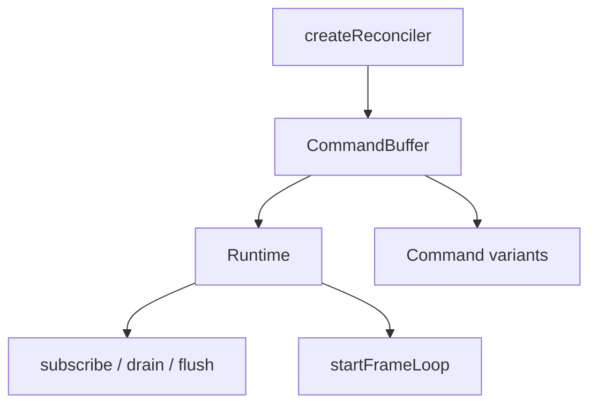

# @bettertui/core

**Framework-agnostic command protocol, tree manipulation, reconciler wrapper, and runtime.** Depends on `@bettertui/shared`. No React.

## Re-exported types (from `@bettertui/shared`)

`NodeId, Point, Size, Rect, Direction, Alignment, Overflow, LayoutConstraints, LayoutResult, RenderCommand, EventType, Event, KeyEvent, MouseButton, MouseEvent, ResizeEvent, ColorValue, Color, Style, BorderStyle, Theme, Frame, FrameCell, RenderNode`

## Local types

| Type | Shape |
|------|-------|
| `NodeType` | `"text" \| "box" \| "flex" \| "input" \| "list" \| "custom"` |
| `NodeOptions` | `{ id?, type: NodeType, props?, children?, style? }` |
| `TreeDiff` | `{ added: string[], removed: string[], updated: string[] }` — **exported but never produced** (no internal producer) |
| `Command` | union (16 variants) |
| `HostContext`, `Instance`, `TextInstance`, `HostConfig`, `CommandBufferConsumer` | reconciler host types |

## Value exports

| Export | Kind | Notes |
|--------|------|-------|
| `CommandBuffer` | class | accumulates `Command`s; `drain()`, `flush()` |
| `createInstance`, `createTextInstance` | fn | emit `CreateNode` / `SetText` |
| `appendChild`, `removeChild`, `insertBefore` | fn | tree ops emitting commands |
| `prepareUpdate`, `commitUpdate`, `commitTextUpdate` | fn | prop diff → `SetStyle` / `SetText` |
| `finalizeInitialChildren`, `resetAfterCommit` | fn | host-config lifecycle |
| `createReconciler(buffer)` | fn | wraps tree ops so each mutation emits a `Command` |
| `Runtime` | class | owns a `CommandBuffer`; `subscribe()`, `drain()`, `flush()`, `startFrameLoop(durationMs=16)`, `stopFrameLoop()`, `dispose()` |

## Diagram

## Keymap (layer-agnostic input binding)

`Keymap` is a framework-agnostic input-binding engine. It lives in `core` (no React), so any adapter can use it. It wraps the native `NapiKeymap` and layers a command registry, key intercepts, and event listeners on top.

| Export | Kind | Notes |
|--------|------|-------|
| `Keymap` | class | binding registry + command dispatch |
| `createTestKeymap`, `createMockNativeKeymap` | fn | testing utilities (from `./testing`) |
| `KeymapEvent`, `CommandHandler`, `CommandContext`, `InterceptHandler`, `InterceptContext`, `KeymapOptions`, `BindingInfo` | type | event/option shapes |

Key surface (all delegated to the native keymap unless noted):

- **Bindings:** `addBinding(layer, id, keys, command, description?, priority?)`, `addSimpleBinding(keys, command, description?)`, `removeLayer(name)`, `activeBindings()`, `allBindings()`.
- **Commands:** `registerCommand(name, handler)`, `unregisterCommand(name)`, `runCommand(name, payload?)`.
- **Chords/modes:** `handleKey(key)`, `hasPending()`, `pendingKeys()`, `clearPending()`, `setMode(mode)`, `currentMode()`, `clearMode()`.
- **Intercepts:** `intercept("key" | "key:after", handler, priority?)` — pre/post key hooks returning a cleanup fn.
- **Events:** `on("state" | "pendingSequence" | "dispatch", listener)` / `off(...)` — subscribe to keymap transitions.

## Notes

- `core` is the heart that `react` and `native` build on. It must never import React.
- `Keymap` is the recommended way to bind keys; `@bettertui/react` re-exports a React provider/hook suite on top of it (see `docs/api/packages/react.md`).
- `TreeDiff` is exported but currently unused internally — treat as a planned auxiliary type.
