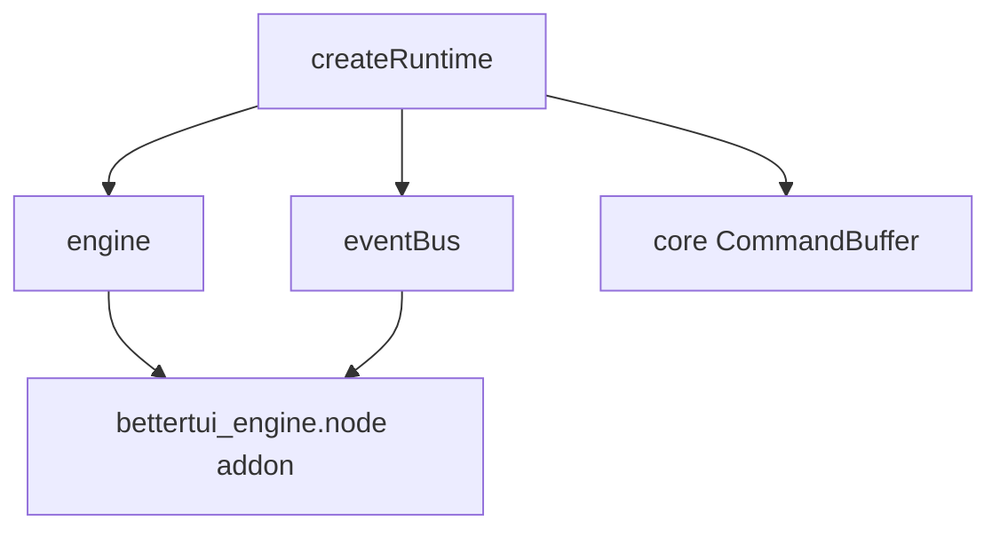

# @bettertui/core (native bridge)

**The native bridge (at `packages/core/src/platform/`) loads the Rust engine addon (`bettertui_engine.node`, built from the `bettertui-engine` crate's `napi` module).** Previously the separate `@bettertui/native` package; now part of `@bettertui/core`.

## Loading

`loadNativeAddon()` does `require("bettertui_engine")` lazily (cached). If the addon is missing it throws:

```
Failed to load native bindings. Run `pnpm --filter @bettertui/core build:native` first.
```

The addon is **not** declared in `package.json` — it must be built separately (`napi build --manifest-path crates/engine/Cargo.toml --features napi`).

## Factories

| Export | Returns | Rust type |
|--------|---------|-----------|
| `createEngine(width?, height?)` | `NapiEngine` | `NapiEngine` |
| `createEventBus()` | `NapiEventBus` | `NapiEventBus` |
| `createFocusManager()` | `NapiFocusManager` | `NapiFocusManager` |
| `createTextEngine()` | `NapiTextEngine` | `NapiTextEngine` |
| `createScheduler()` | `NapiScheduler` | `NapiScheduler` |
| `createKeymap()` | `NapiKeymap` | `NapiKeymap` |
| `detectCapabilities()` | `TerminalCapabilities` | JSON from `detectCapabilities` |
| `getVersion()` | `string` | `getVersion` |

## Runtime & event loop

| Export | Returns | Notes |
|--------|---------|-------|
| `createRuntime(engine, eventBus, buffer)` | `Runtime` | `{ engine, eventBus, buffer, processCommands(), renderFrame(), resize(), shutdown() }` |
| `createEventLoop(eventBus)` | `EventLoop` | `{ start, stop, pushKey, pushMouse, drain, onEvent }` |

## Re-exported types

`NapiEngine, NapiEventBus, NapiFocusManager, NapiTextEngine, NapiScheduler, ProcessResult, TerminalCapabilities, SchedulerStats, Runtime, RuntimeOptions, EventLoop, EventCallback, KeyEvent, MouseEvent`

## Diagram



## Status

Implemented at `packages/core/src/platform/`. All native factories throw at runtime unless the Rust addon is built first.
