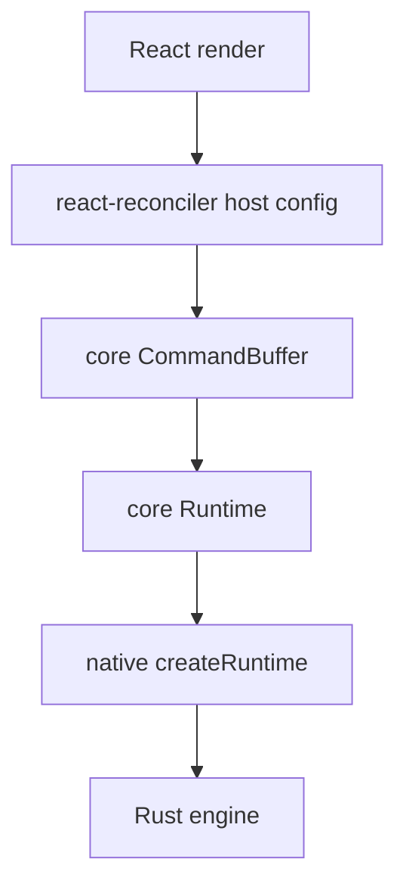

# @bettertui/react

**React 19 adapter.** Depends on `@bettertui/core`, `@bettertui/shared`, `react-reconciler`; peer `react@^19`.

## Implemented

- `renderer.ts` — `createBetterTUIReconciler(buffer)`, `createContainer()`, `updateContainer()`, full host config (mutation mode) over core `Instance`/`TextInstance`/`CommandBufferConsumer`.
- `runtime.tsx` — `render(element)` returns `{ root, runtime, dispose }`; `RuntimeProvider` + `useRuntime()`.
- `hooks/index.tsx` — `Provider`/`useTheme`, `FocusProvider`/`useFocus`, `useKeyboard`, `TerminalProvider`/`useTerminal`, `useFrame`, `useClipboard`, `useAnimation`, plus the keymap suite: `KeymapProvider`/`useKeymap`, `useKeymapEvent`, `useActiveBindings`, `usePendingSequence`, `useCommand`, `useKeyIntercept`, `useKeymapMode`, and the re-exported `Keymap` class.

## Exported hooks/providers

`Provider, useTheme, FocusProvider, useFocus, useKeyboard, TerminalProvider, useTerminal, useFrame, useClipboard, useAnimation, useMouse, useSelection, SelectionProvider, useCapabilities, CapabilitiesProvider, useResize, useTimeline, easings, KeymapProvider, useKeymap, useKeymapEvent, useActiveBindings, usePendingSequence, useCommand, useKeyIntercept, useKeymapMode, Keymap, render, RuntimeProvider, useRuntime`

## Exported hook types

`Theme, ThemeColors, ThemeSpacing, ProviderProps, KeyEvent, MouseState, EasingFunction, UseAnimationOptions, TimelineAnimation, Timeline, KeymapEvent, KeymapOptions, CommandHandler, BindingInfo` (note: `Theme` here is React-authored, distinct from `@bettertui/shared`'s `Theme`)

## Exported components (53, currently thin wrappers)

All 53 are exported from `index.ts` with typed `*Props` interfaces:

- **Layout:** `Box`, `Flex`, `Grid`, `Stack`, `Spacer`, `Separator`
- **Typography:** `Text`, `Heading`, `Label`, `Code`, `Blockquote`
- **Interactive:** `Button`, `Input`, `Textarea`, `Checkbox`, `Radio`, `Switch`, `Slider`, `Select`, `Combobox`
- **Navigation:** `Tabs`, `Accordion`
- **Feedback:** `Badge`, `Progress`, `Spinner`
- **Data:** `List`, `Tree`, `Table`, `DataTable`
- **Overlays:** `Tooltip`, `Modal`, `Popover`, `Dropdown`, `ContextMenu`, `Toast`
- **Status:** `StatusLine`, `StatusBar`
- **Container:** `Pane`, `Viewport`, `Calendar`, `Chart`, `ScrollArea`
- **Content:** `Markdown`, `CodeBlock`, `Diff`
- **Chat:** `PromptComposer`, `ChatView`, `ThinkingIndicator`
- **Terminal:** `Terminal`, `TerminalViewport`, `TerminalProcess`
- **Native:** `Slot`, `NerdFont`

They emit element descriptors via `createElement` and are not yet wired to a live native render loop.

## Keymap hooks

Built on `@bettertui/core`'s `Keymap`. Wrap the tree in `KeymapProvider` to get a shared keymap instance, then use the hooks below (each requires `KeymapProvider`).

| Hook | Purpose |
|------|---------|
| `useKeymap()` | access the shared `Keymap` instance |
| `KeymapProvider({ keymap?, options? })` | provide a `Keymap` to descendants |
| `useKeymapEvent(handler, deps?)` | subscribe to keymap state events |
| `useActiveBindings()` | reactive list of currently active bindings |
| `usePendingSequence()` | `{ hasPending, keys }` for in-progress chords |
| `useCommand(name, handler)` | register/unregister a named command |
| `useKeyIntercept("key" \| "key:after", handler)` | pre/post key intercept (returns cleanup) |
| `useKeymapMode(mode)` | set/clear the active keymap mode |

## Diagram

## Status

Renderer + hooks + runtime are real and wired. 13 component functions are exported (`Box`, `Text`, `Code`, `Input`, `Textarea`, `Select`, `Slider`, `TabSelect`, `ScrollBar`, `ScrollBox`, `Markdown`, `Diff`, `TextTable`) and emit element descriptors consumed by the reconciler.
