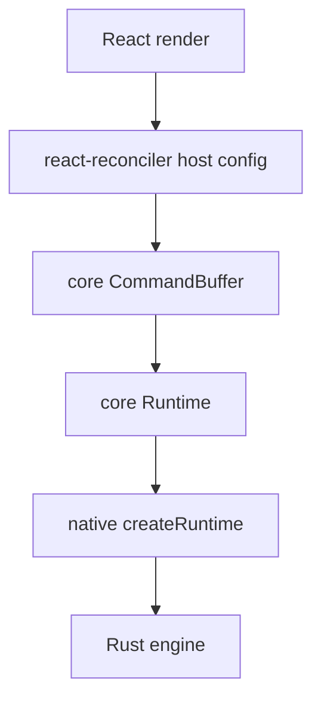

# @bettertui/react

**React 19 adapter.** Depends on `@bettertui/core`, `@bettertui/shared`, `react-reconciler`; peer `react@^19`.

## Implemented

- `renderer.ts` — `createBetterTUIReconciler(buffer)`, `createContainer()`, `updateContainer()`, full host config (mutation mode) over core `Instance`/`TextInstance`/`CommandBufferConsumer`.
- `runtime.tsx` — `render(element)` returns `{ root, runtime, dispose }`; `RuntimeProvider` + `useRuntime()`.
- `hooks/index.tsx` — `Provider`/`useTheme`, `FocusProvider`/`useFocus`, `useKeyboard`, `TerminalProvider`/`useTerminal`, `useFrame`, `useClipboard`, `useAnimation`.

## Exported hooks/providers

`Provider, useTheme, FocusProvider, useFocus, useKeyboard, TerminalProvider, useTerminal, useFrame, useClipboard, useAnimation, render, RuntimeProvider, useRuntime`

## Exported hook types

`Theme, ThemeColors, ThemeSpacing, ProviderProps, KeyEvent` (note: `Theme` here is React-authored, distinct from `@bettertui/shared`'s `Theme`)

## Exported components (currently **stubs**)

`Box, Text, Flex, Spacer, Button, Input, Textarea, Tabs, Modal, Badge, Progress, Spinner, Tooltip, Separator, Heading, Label, Code, Grid, Stack`

Each has a typed `*Props` interface. Most return `props.children` cast to `JSX.Element` or `null` — they do **not** yet wire into the reconciler. `Box`, `Text`, `Flex`, `Modal`, `Badge`, `Tooltip`, `Heading`, `Label`, `Code`, `Grid`, `Stack` return children; `Spacer`, `Input`, `Textarea`, `Tabs`, `Progress`, `Spinner`, `Separator` return `null`.

## Diagram

## Status

Renderer + hooks + runtime are real and wired. 69 component functions are exported but are currently thin wrappers (they emit element descriptors, not yet connected to a live native render loop). Do not document components as painting pixels yet.
