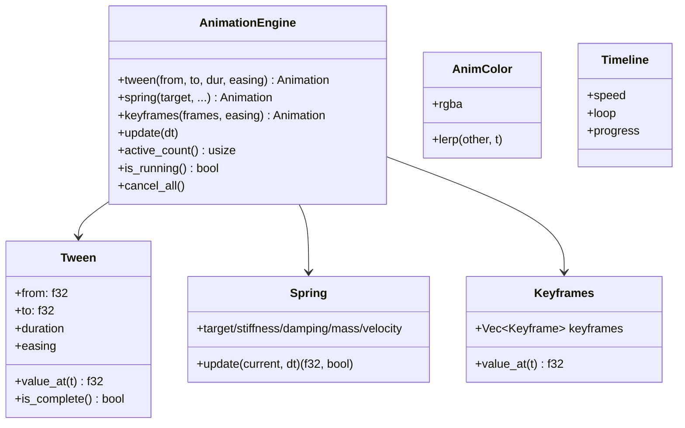
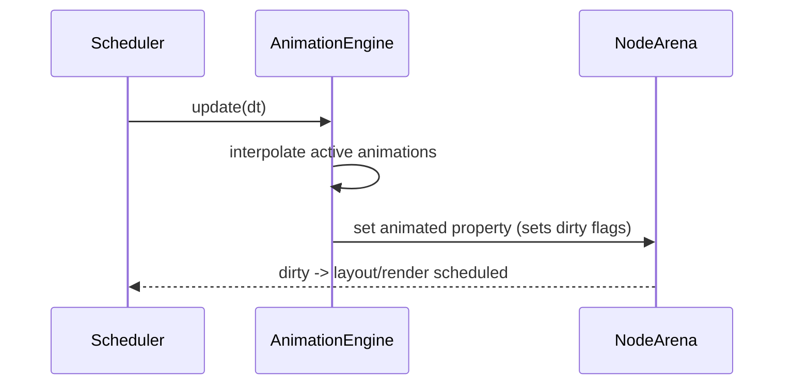

# Animation

The animation engine provides tween, spring, keyframe, and color interpolation. Code: `native/engine/src/animation/` (single `mod.rs`, ~1200 lines, ~30 tests). It is decoupled from rendering and driven by the `Scheduler`.

## Types

- `Easing`: Linear, EaseIn/Out/InOut, quadratic/cubic/expo/bounce/elastic, `CubicBezier(f32,f32,f32,f32)`, `Steps(u32, StepJump)`. `apply(t) -> f32`.
- `AnimationState`: Idle, Playing, Paused, Completed.
- `AnimatableValue`: `Float` | `Color`. `AnimatableProperty` enumerates which node property is animated.

## Integration

## From TypeScript

`@bettertui/react` exposes `useAnimation()`; `@bettertui/native` exposes `NapiScheduler.schedule_animation()` through the bindings.

> Known issue (Phase 8 review): `schedule_animation()`/`cancel_animation()` exist but animation callbacks were not being executed at the time of the review — documented as a half-implemented path.
