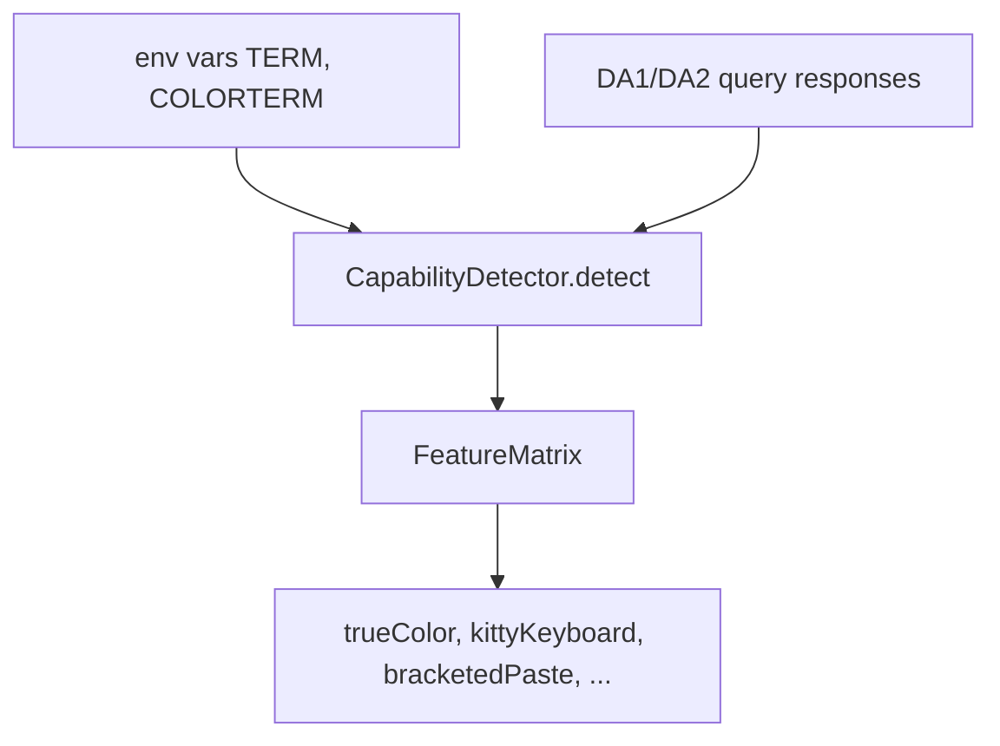

# Capabilities

Capability detection identifies what a terminal supports so the renderer and input system only use features the terminal understands. Code: `packages/core/crates/engine/src/capabilities/`.

## Detection

- `CapabilityDetector::detect()` plus `update_from_queries(&[QueryResult])` (queries defined in `terminal/query.rs`: DA1/DA2/DA3/DSR/DECID/XTVersion/Kitty).
- `global_capabilities() -> &'static CapabilityDetector` — a `OnceLock` singleton used directly by the bindings.
- `TerminalBrand` (Kitty, Ghostty, WezTerm, Alacritty, Foot, ITerm2, Tmux, WindowsTerminal, VSCodeTerminal, Unknown) via `brand_from_da2_model`.

## Feature matrix

`FeatureMatrix` (with `default_for_brand`) tracks:

| Group | Fields |
|-------|--------|
| Render | `trueColor`, `underlineColor`, `strikethrough`, `cursorStyle`, `synchronizedOutput` |
| Input | `kittyKeyboard`, `csi_u`, `bracketedPaste`, `focusEvents`, `mouse` |
| Graphics | `osc52`, `osc8`, `kittyGraphics`, `sixel`, `itermImages`, `alternateScroll` |

Each sub-capability module (`rendering.rs`, `input.rs`, `graphics.rs`, `window.rs`, `unicode.rs`, `clipboard.rs`, `brand.rs`) provides its slice. `UnicodeCapabilities` covers `EmojiWidth` and `UnicodeVersion`.

## TypeScript surface

`@bettertui/core` exposes `detectCapabilities() -> TerminalCapabilities` (JSON, camelCase fields) and `NapiCapabilities` (17 fields). Clipboard capability specifics live in `capabilities/clipboard.rs` (`ClipboardCapabilities { osc52, osc8 }`).
