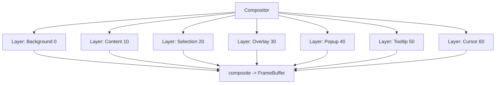

# Compositor & Screen

Layered compositing builds the final frame buffer from stacked layers; the screen module manages viewport, alternate screen, scrollback, and selection. Code: `packages/core/crates/engine/src/compositor/` and `packages/core/crates/engine/src/screen/`.

## Layers



- `Compositor { layers: Vec<Layer>, width, height }`: `add_layer(LayerType) -> LayerId`, `remove_layer`, `get_layer`, `composite(&mut FrameBuffer)`, `resize`, `clear`.
- `Layer { id, layer_type, visible, opacity, offset_x/y, buffer: FrameBuffer }`. `set_cell`, `get_cell(x,y) -> Option<Cell>` (by value), `set_char`, `fill`, `fill_rect`, `set_opacity` (clamped 0..1), `set_offset`, `is_empty`.
- `enum LayerType { Background(0), Content(10), Selection(20), Overlay(30), Popup(40), Tooltip(50), Cursor(60) }` — `z_index()` follows this ordering; `Selection`/`Cursor` are transparent.

## Screen state

`screen/mod.rs`:

```rust
pub struct ScreenState {
    viewport: TerminalViewport,
    alternate_screen: AlternateScreen,
    cursor: CursorState,
    scrollback: ScrollbackBuffer,
    selection_active: bool,
    selection_start: Option<Point>,
    selection_end: Option<Point>,
    dirty: bool,
}
```

- `enter/leave_alternate_screen`, `scroll_up/down/reset`, `set/clear_selection`, `resize`, `push_scrollback_line`.
- `enum AlternateScreen { Main, Alternate }`, `enum CursorStyle { Block, Underline, Bar, Hidden }`.

## CompositorRenderer

`compositor/renderer.rs` (`CompositorRenderer`) drives the composite step. The compositor is independent of the arena; the `renderer` pipeline composites after painting into the content layer.
