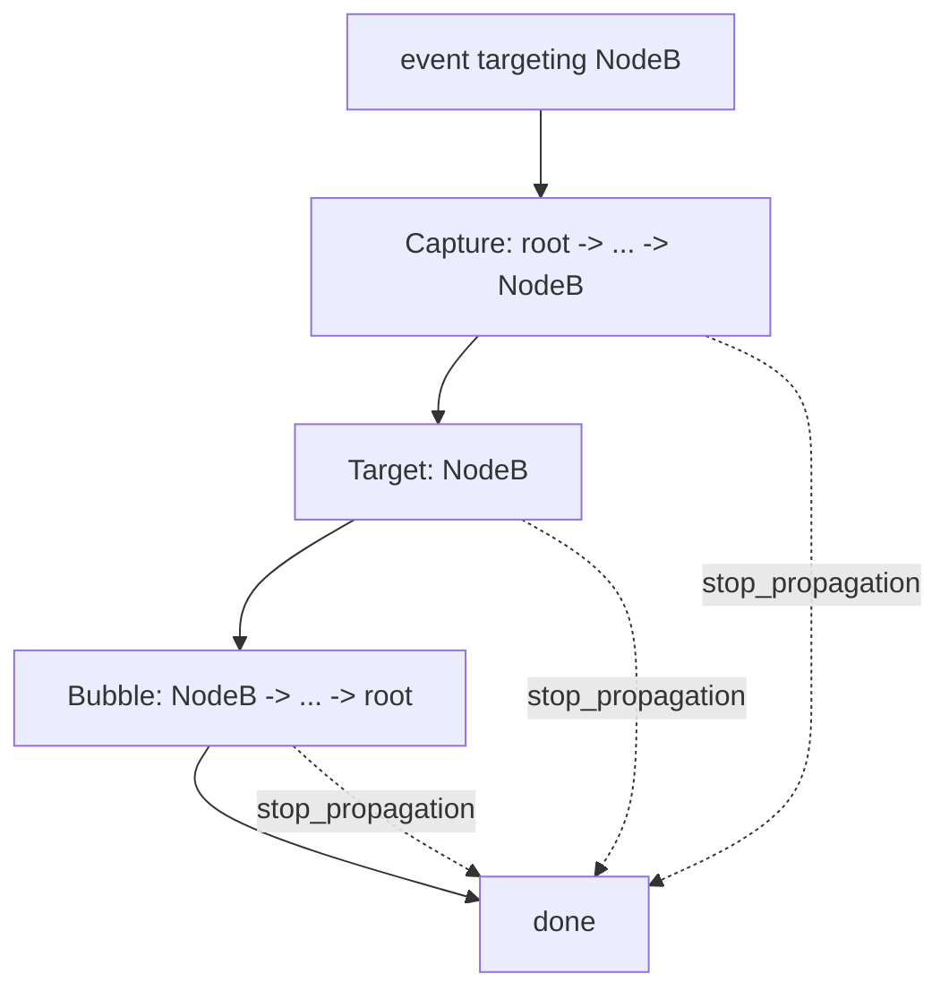
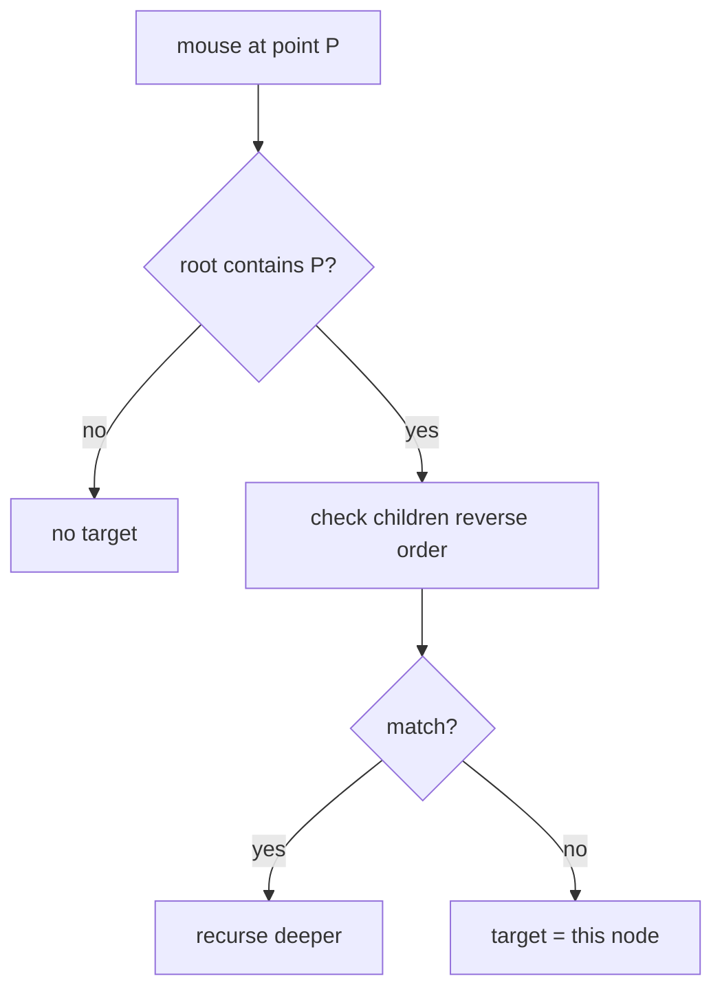

# Event System

Events flow from terminal input up to nodes and back down, following DOM-style capture → target → bubble. Code: `native/engine/src/events/`.

## Event enum

```rust
pub enum Event {
    Key(KeyEvent),
    Mouse(MouseEvent),
    Paste(PasteEvent),
    Focus(FocusEvent),
    Blur(BlurEvent),
    Resize(ResizeEvent),
    Lifecycle(LifecycleEvent),
}
```

Each event has a `phase()` (`Capture`/`Target`/`Bubble`) and `is_consumed()`.

## Propagation



- `EventBus` holds a `VecDeque<Event>` (max 256) with `push_key`, `push_mouse`, `push_paste`, `push_resize`, `drain`.
- Mouse events are coalesced (only the most recent position is kept).
- `EventDispatcher` routes events to the focused/hit-tested node.

## Hit testing

For mouse events, the system walks the tree from root, testing each node's layout rect, recursing into children in reverse (z-order), returning the deepest matching node.



## Key & mouse types

- `Key::Character(char)`, `Key::Enter`, `ArrowUp`, `F(u8)`, `Ctrl(char)`, `Alt(char)` …
- `Modifiers { ctrl, shift, alt, meta }`
- `MouseButton` (Left/Right/Middle/ScrollUp/Down/ScrollLeft/ScrollRight/None)

The real keyboard/mouse *parsing* lives in `input/keyboard.rs` and `input/mouse.rs` (the top-level `keyboard/` and `mouse/` modules are thin stubs).

## Resize

Detected via crossterm poll / SIGWINCH. On resize the root recomputes layout and the frame buffer is resized.

## Focus

`FocusManager` (in `focus/`) tracks one focused node, tab order, directional traversal, and scopes. Exposed to TypeScript as `NapiFocusManager` (`focus()`, `blur()`, `traverse(direction)`, `focusOrder()`, `setScope()` ...).
