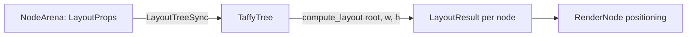
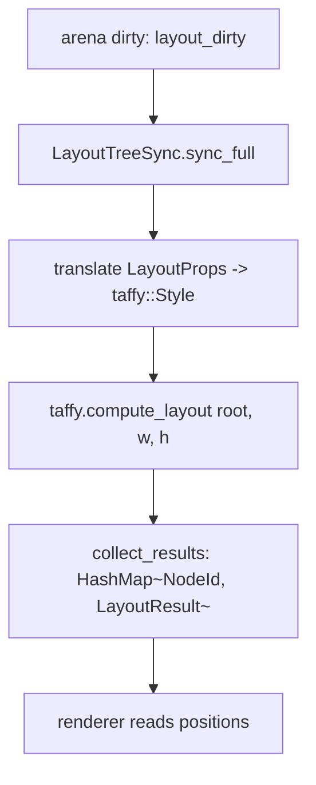

# Layout System

BetterTUI lays out nodes with **Taffy** (CSS flexbox) adapted to a terminal cell grid. Code lives in `native/engine/src/layout/`.

## Mapping



- `LayoutEngine` wraps `taffy::TaffyTree<()>` plus a `HashMap<NodeId, taffy::NodeId>` mirror.
- `LayoutTreeSync` owns the engine and a results cache; `sync_full(arena)` takes only the arena (no separate engine ref).
- `LayoutResult { x, y, width, height, content_width, content_height: u16 }`.

## Why cells are pixels

Taffy works in floats/pixels. BetterTUI configures Taffy so its "pixel" unit means "terminal cell": styles use cell counts as pixel values, and Taffy's output is rounded to integers only at the end. `LayoutProps` uses `f32` internally (flex math needs fractions); final positions are `u16`.



## Sizing & overflow

- `width/height` accept `Auto`, fixed, or percent.
- `overflow: Scroll` marks a scroll container; `ScrollExtent` tracks content vs viewport and clamps offsets.
- `display: None` removes a node from layout entirely (CSS `display: none`).

## React Component Layout Props

The React components (`@bettertui/react`) expose the full layout capabilities:

### Box / Flex / Grid Components

```tsx
<Box
  // Flexbox
  flexDirection="row"
  justifyContent="space-between"
  alignItems="center"
  alignSelf="flex-start"
  flexWrap="wrap"
  flexGrow={1}
  flexShrink={0}
  flexBasis="50%"

  // Gap
  gap={8}
  // Or per-axis: gap={{ row: 8, column: 4 }}

  // Padding (uniform or per-side)
  padding={4}
  // Or: padding={{ top: 1, right: 2, bottom: 1, left: 2 }}
  paddingTop={1}

  // Margin (uniform or per-side)
  margin={2}
  marginTop={0}

  // Sizing
  width="100%"
  height={20}
  minWidth={10}
  maxWidth={80}
  minHeight={5}
  maxHeight={30}

  // Positioning
  position="absolute"
  top={5}
  left={10}
  zIndex={100}

  // Visibility
  visible={true}
>
  {children}
</Box>
```

### Stack Component

```tsx
<Stack
  width={40}
  height={20}
  padding={2}
  position="relative"
  zIndex={10}
>
  <StackChild zIndex={1} offsetX={5} offsetY={3}>
    {content}
  </StackChild>
</Stack>
```

## Validation

The `@bettertui/core` package provides validation utilities:

```tsx
import { validate, warnIfInvalid } from "@bettertui/core";

// Validate layout and style props
const result = validate(
  { flexGrow: 1, width: "100%" },
  { fg: "#ffffff" }
);

if (!result.valid) {
  console.error(result.errors);
}

// Development-mode warnings
warnIfInvalid(layout, style, "MyComponent");
```

## Edge cases

- Empty trees still lay out the root at terminal size.
- The tree invariant prevents cycles (`is_ancestor` guard).
- Zero-size nodes are valid (used for hit testing / focus).
