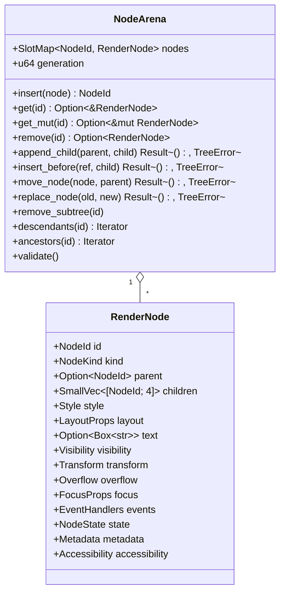
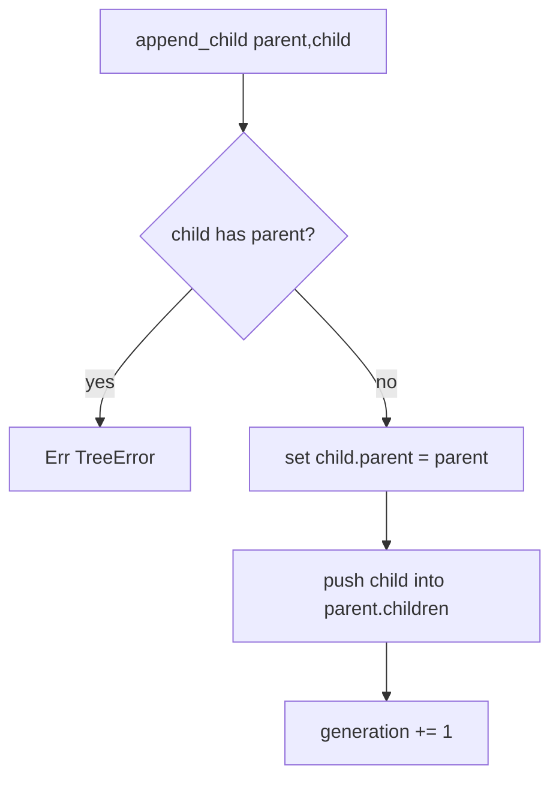
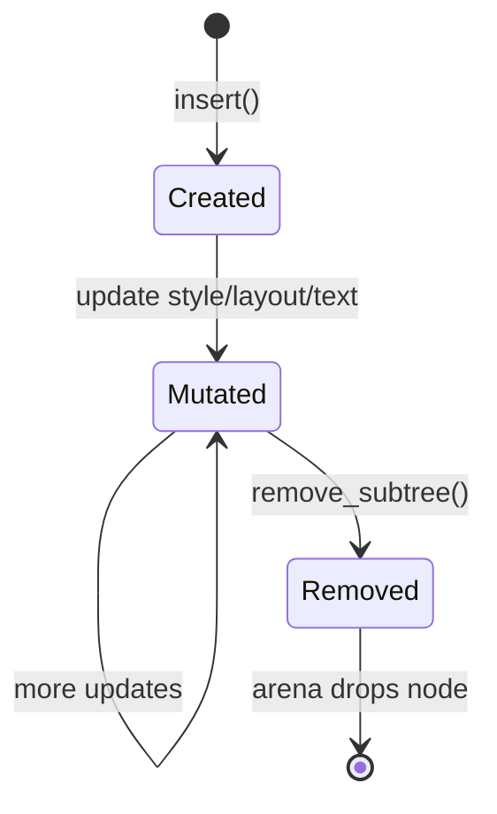
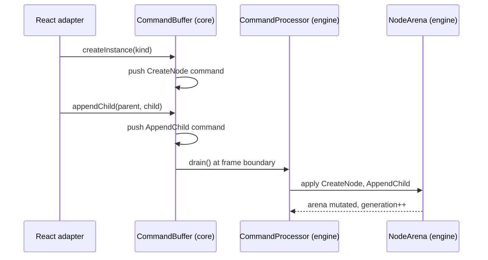

# Node Model

The node tree is the single source of truth the Rust renderer reads from. It lives in the `tree` module of `bettertui-engine` and is arena-allocated with generational indices.

## Storage



- `NodeId = slotmap::DefaultKey` — 8-byte generational index. Stored as `u64` across the FFI boundary (transmuted, since both are 8-byte `#[repr(transparent)]`).
- `NodeArena` wraps a `SlotMap`. Incrementing `generation` on every mutation lets the renderer short-circuit when nothing changed.
- `RenderNode` is ~256–320 bytes. Up to 4 children stored inline via `SmallVec<[NodeId; 4]>` (no heap allocation for the common case).

## NodeKind

```rust
pub enum NodeKind {
    Box, Text, Flex, Input, List, Table, Tree,
    Scroll, Tab, Modal, Spacer, Separator, Custom(u16),
}
```

Used by the renderer and widgets to decide behavior. `Custom(u16)` allows widget-defined node types.

## Key Sub-types

| Type | File | Notes |
|------|------|-------|
| `Style` | `tree/style.rs` | `Option<bool>` per attribute to allow inheritance |
| `Color { Named, Indexed, Rgb, Default }` | `tree/color.rs` | Stores intent; resolved at render time |
| `LayoutProps` | `tree/layout.rs` | Maps to Taffy flexbox |
| `Visibility { display, opacity, clip }` | `tree/visual.rs` | |
| `Transform { translate_x, translate_y, z_index }` | `tree/visual.rs` | integer offsets (cell grid) |
| `Overflow { Visible, Hidden, Scroll }` | `tree/node_kind.rs` / layout | |
| `FocusProps` | `tree/interaction.rs` | `tab_index`, `focusable`, `focused` |
| `EventHandlers` | `tree/interaction.rs` | per-node handler state |
| `NodeState { scroll_*, dirty flags }` | `tree/interaction.rs` | `layout_dirty`, `render_dirty`, `dirty` |
| `Metadata` / `Accessibility` | `tree/metadata.rs` | boxed; present only when set |

## Tree Operations

All mutations go through `NodeArena` and are bidirectional (parent pointer + children list kept in sync atomically). The tree invariant — every node has exactly one parent except `root` — is enforced at operation time via `Result<(), TreeError>`.



## Lifecycle



## Integration with Framework Adapters

A framework adapter never touches `NodeArena` directly. It emits `Command`s (see [Protocol.md](Protocol.md)) which are applied to the arena by the command processor. This is what keeps the engine framework-agnostic.


