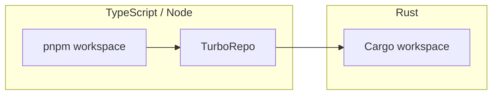
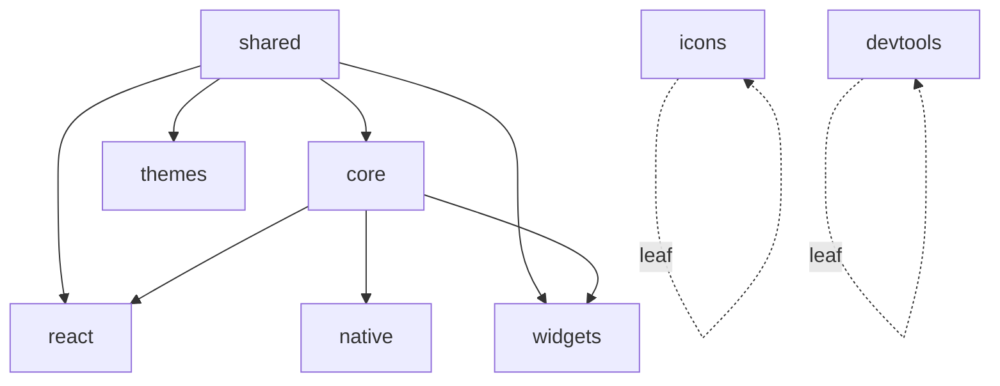
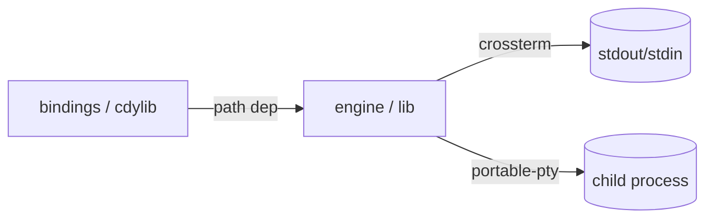
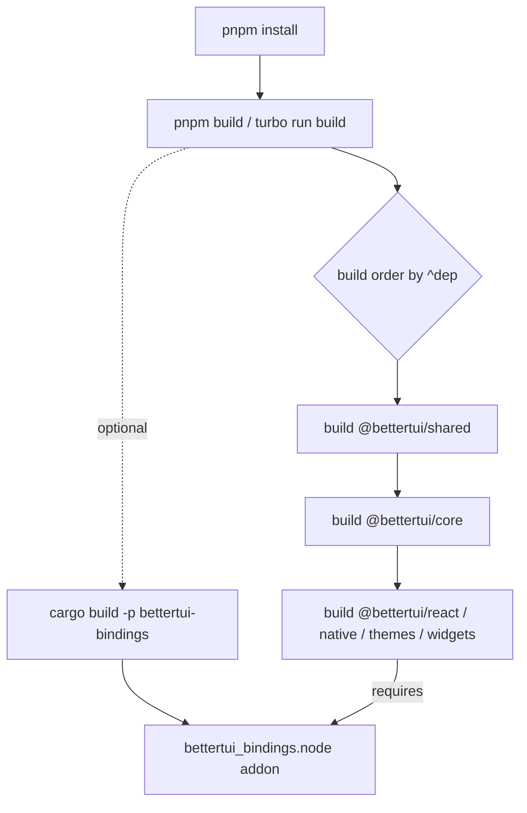
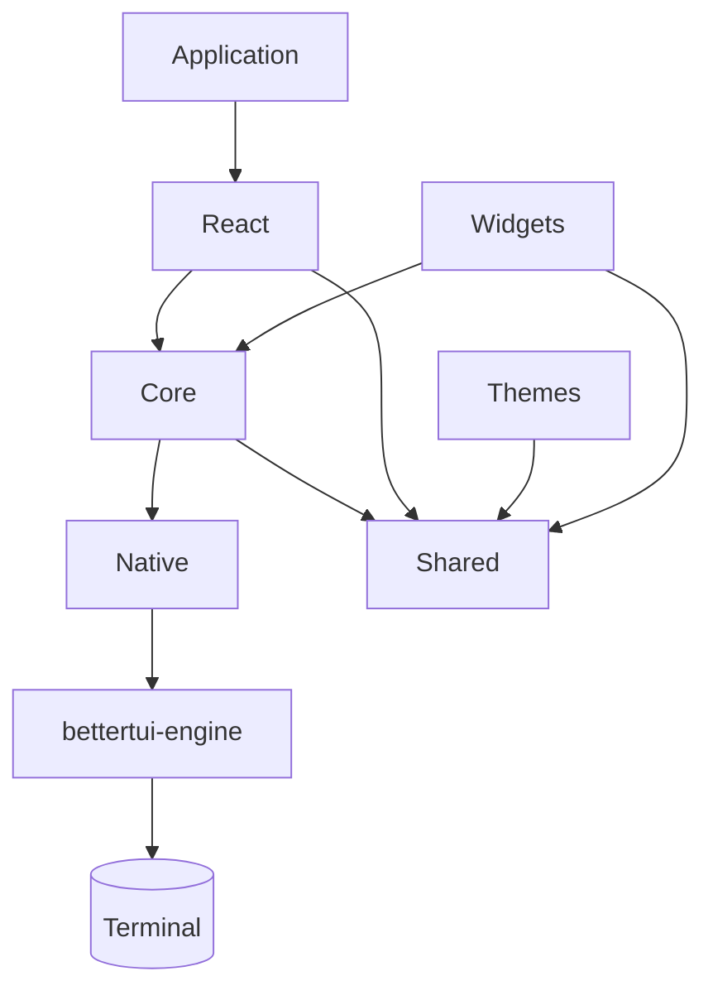

# Repository Overview

This document describes the physical and logical structure of the BetterTUI repository as it exists today. It is the entry point for understanding the codebase before reading any other module.

## Workspaces

BetterTUI is a single repository managed by three workspace systems:



- **pnpm workspace** (`pnpm-workspace.yaml`) declares the publishable/linked packages:
  - `apps/*`
  - `packages/*`
  - `native/bindings` (the napi-rs cdylib)
  - `examples/*`
- **TurboRepo** (`turbo.json`) orchestrates `build`, `dev`, `lint`, `format`, `format:check`, `typecheck`, `clean`. `build`/`lint`/`typecheck` depend on `^build`/`^lint`/`^typecheck` so dependencies build before dependents.
- **Cargo workspace** (`Cargo.toml`, `resolver = "2"`) contains the two Rust crates:
  - `native/engine` → `bettertui-engine` (the library)
  - `native/bindings` → `bettertui-bindings` (the napi-rs cdylib)

> Note: `native/engine` is **not** in `pnpm-workspace.yaml` (it is pure Rust). `apps/website` is TypeScript but is a docs site, not part of the framework.

## Directory Layout

```
bettertui/
├── native/
│   ├── engine/        # bettertui-engine (Rust library) — rendering, layout, input, etc.
│   └── bindings/      # bettertui-bindings (Rust cdylib) — napi-rs FFI surface
├── packages/
│   ├── shared/        # @bettertui/shared  — type-only foundation (zero runtime code)
│   ├── core/          # @bettertui/core    — command protocol, tree ops, runtime
│   ├── react/         # @bettertui/react   — React 19 adapter
│   ├── native/        # @bettertui/native  — bridge to the Rust engine addon
│   ├── widgets/       # @bettertui/widgets — widget interface (stub)
│   ├── themes/        # @bettertui/themes  — theme defs + factory
│   ├── icons/         # @bettertui/icons   — icon registry
│   └── devtools/      # @bettertui/devtools — devtools stub
├── apps/
│   └── website/       # @bettertui/website — Astro/Starlight docs + landing site
├── examples/          # example apps (mostly stubs; counter is partially wired)
├── docs/              # this documentation
├── benchmarks/        # empty placeholder (no harness implemented)
├── scripts/           # empty placeholder (scripts live in package.json/turbo.json)
├── tasks/             # PRDs, reports, archived slop
├── Cargo.toml         # Rust workspace manifest
├── Cargo.lock
├── package.json       # root TS manifest + pnpm scripts
├── pnpm-workspace.yaml
├── turbo.json
├── biome.json         # Biome config (TS/JS/JSON lint+format)
└── tsconfig.json
```

## TypeScript Package Layout

All TypeScript packages are ESM-only, built with `tsup` (`dts: true`), and export their public API from a single `src/index.ts`.

| Package | `private` | Depends on | Role |
|---------|-----------|-----------|------|
| `@bettertui/shared` | yes | — | Pure type definitions (no runtime code) |
| `@bettertui/core` | yes | `shared` | Framework-agnostic command buffer, tree ops, reconciler wrapper, runtime |
| `@bettertui/react` | yes | `core`, `shared`, `react-reconciler` | React 19 adapter (host config, hooks, components) |
| `@bettertui/native` | **no** | `core` | Loads `bettertui_bindings` addon; factories + runtime + event loop |
| `@bettertui/widgets` | yes | `core`, `shared` | `Widget` interface + version constant (stub) |
| `@bettertui/themes` | yes | `shared` | `defaultTheme`, `createTheme()` |
| `@bettertui/icons` | yes | — | In-memory icon registry |
| `@bettertui/devtools` | yes | — | `createDevTools()` returns `null` (stub) |



## Rust Crate Layout

| Crate | Type | Purpose |
|-------|------|---------|
| `bettertui-engine` | `lib` | All engine logic: tree, layout, renderer, framebuffer, events, input, animation, pty, terminal, text, widgets, capabilities, scheduler, etc. |
| `bettertui-bindings` | `cdylib` | napi-rs FFI surface exposing the engine to Node.js. Thin translation layer only. |

The bindings crate depends on `bettertui-engine` (`path = "../engine"`) and contains **no** Rust unit tests — all verification lives in `bettertui-engine` plus the TS layer above.



## Build System



Key root scripts:

| Script | Command |
|--------|---------|
| `pnpm build` | `turbo run build` |
| `pnpm lint` | `turbo run lint` (Biome) |
| `pnpm typecheck` | `turbo run typecheck` |
| `pnpm format` / `format:check` | Biome format (cache disabled) |
| `pnpm check` | lint + format:check + typecheck + `cargo:check` |
| `pnpm cargo:check/test/fmt/clippy` | Cargo passthroughs |

The Rust addon (`bettertui_bindings`) is **not** declared in any package.json — `@bettertui/native` `require("bettertui_bindings")` at runtime and throws a clear error if the addon was not built first (`cargo build -p bettertui-bindings`).

## Dependency Direction (the rule)



Rules enforced by code, not just policy:
- `bettertui-engine` must never import any JS framework.
- `@bettertui/core` must never import React.
- Only `@bettertui/react` imports React.
- The only boundary between a UI framework and the engine is the **command** — so adding Vue/Solid/Svelte/vanilla-TS adapters requires no Rust changes.

## Architecture Layers

```mermaid
graph TD
    subgraph L1[Framework Adapter Layer — TypeScript]
        R[@bettertui/react]
    end
    subgraph L2[Core TypeScript Layer]
        C[@bettertui/core]
        N[@bettertui/native]
        S[@bettertui/shared]
    end
    subgraph L3[Rust Engine Layer]
        E[bettertui-engine]
    end
    subgraph L4[Terminal]
        T[crossterm / portable-pty]
    end
    R --> C
    C --> N
    N -->|napi-rs| E
    E --> T
```

- **Layer 1 (React adapter).** Translates React's virtual DOM operations into core `Command`s via a `react-reconciler` host config.
- **Layer 2 (Core TypeScript).** Owns the command protocol, tree manipulation, runtime/frame loop, and the native bridge.
- **Layer 3 (Rust engine).** Owns the arena, layout, rendering, events, input, animation, text, PTY, terminal emulation, capabilities.
- **Layer 4 (Terminal).** Raw bytes in/out via crossterm and child processes via portable-pty.
