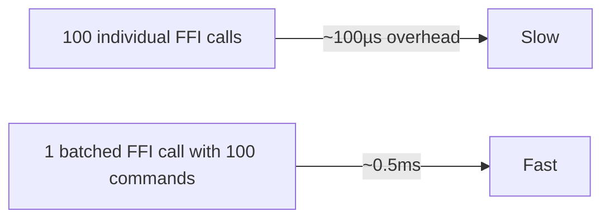
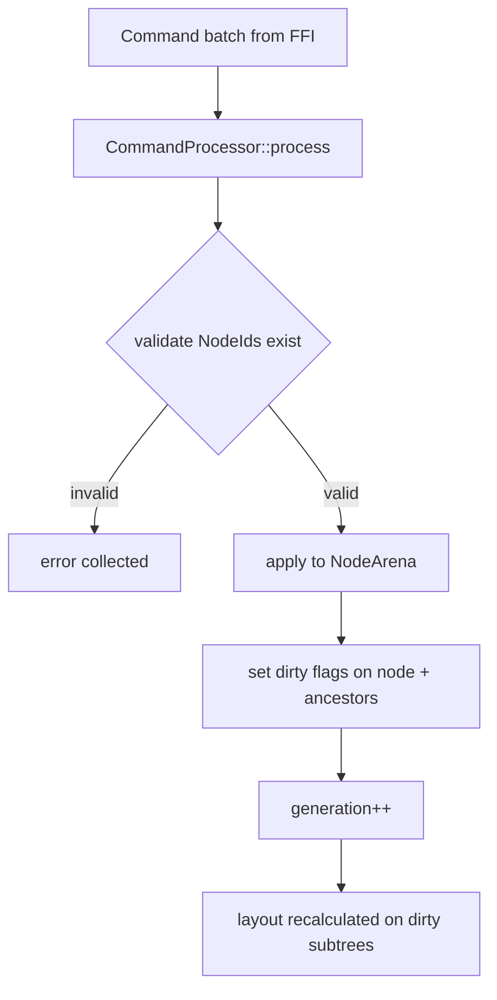
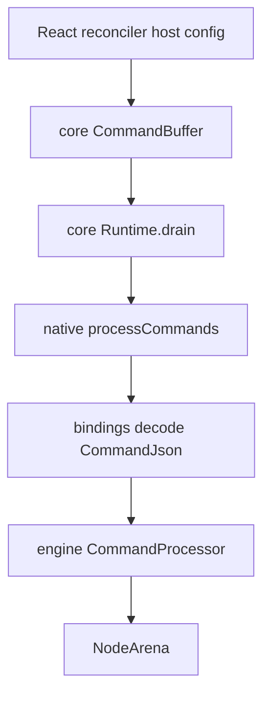

# Command Protocol

The command protocol is the **only** interface between TypeScript and the Rust engine. It is the boundary that keeps the engine framework-agnostic. Every framework adapter (React today, Vue/Solid/Svelte later) translates its tree operations into `Command`s.

## Why commands?

Batching reduces FFI overhead, lets commands be logged/replayed for debugging, and lets the engine process a frame atomically. The engine internally normalizes all commands to fine-grained operations.

## The Command enum (`protocol/command.rs`)

The Rust `Command` enum has ~41 variants grouped by category. The napi bindings accept the same set via a `CommandJson` serde enum (41 variants mapped 1:1):

| Category | Variants |
|----------|----------|
| Tree (7) | `CreateNode`, `RemoveNode`, `AppendChild`, `InsertBefore`, `MoveNode`, `ReplaceNode`, `DetachNode` |
| Style (8) | `SetStyle`, `SetForeground`, `SetBackground`, `SetBold`, `SetItalic`, `SetUnderline`, `SetStrikethrough`, `SetDim`, `SetInverse`, `SetHidden` |
| Layout (16) | `SetLayout`, `SetFlexDirection`, `SetJustifyContent`, `SetAlignItems`, `SetAlignSelf`, `SetWidth`, `SetHeight`, `SetMinWidth`, `SetMinHeight`, `SetMaxWidth`, `SetMaxHeight`, `SetFlexBasis`, `SetPadding`, `SetMargin`, `SetGap`, `SetFlexGrow`, `SetFlexShrink`, `SetPosition`, `SetInset` |
| Content (3) | `SetText`, `SetAttribute`, `RemoveAttribute` |
| Visibility (3) | `SetDisplay`, `SetOpacity`, `SetClip` |
| Transform (3) | `SetTranslateX`, `SetTranslateY`, `SetZIndex` |
| Overflow (1) | `SetOverflow` |
| Focus (3) | `FocusNode`, `BlurNode`, `SetTabIndex` |
| Frame (3) | `BeginFrame`, `CommitFrame`, `Invalidate` |
| Lifecycle (1) | `Shutdown` |

## Processing Pipeline

Files: `protocol/command.rs` (enum), `protocol/processor.rs` (`CommandProcessor`), `protocol/buffer.rs` (`CommandBuffer`), `protocol/{error,result}.rs`.

## TypeScript side

`@bettertui/core` builds commands incrementally in a `CommandBuffer` and drains them at frame boundaries. The `Runtime` (also in `@bettertui/core`) owns the buffer and flushes to subscribers. `@bettertui/native`'s `createRuntime()` ties a native engine + event bus + core `CommandBuffer` together and drives `processCommands()` / `renderFrame()`.

> The current implementation uses a **JSON command envelope** decoded in `bindings/src/lib.rs` (the `CommandJson` enum), not a hand-rolled binary codec. There is no separate `@bettertui/protocol` package — the protocol lives inside `bettertui-engine`'s `protocol` module and `@bettertui/core`'s `command-buffer.ts`.
