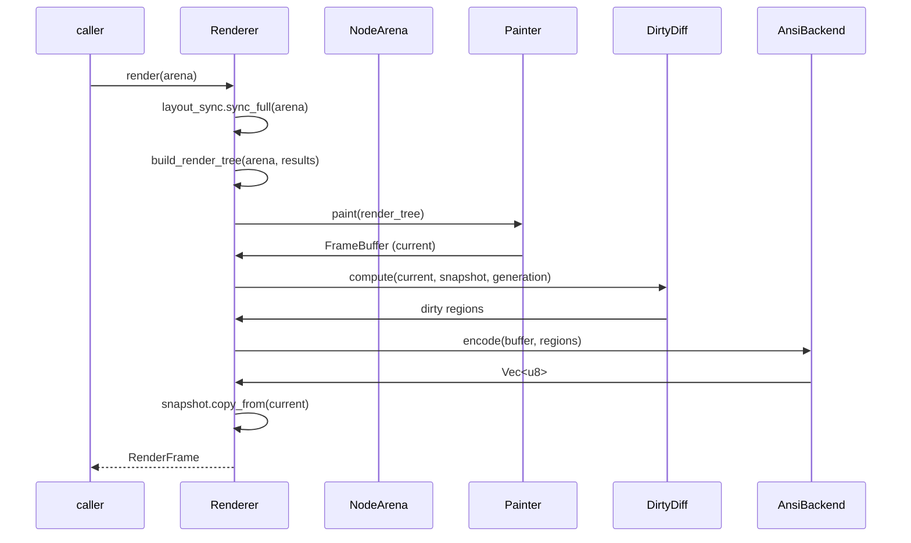

# Rendering Pipeline

The rendering pipeline turns the arena node tree into ANSI bytes on stdout. It lives mostly in the `renderer`, `render_object`, `painter`, `framebuffer`, and `dirty_diff` modules.

## Stages


Files: `renderer/mod.rs` (`Renderer`), `renderer/backend/ansi.rs` (`AnsiBackend`), `render_object/` (`build_render_tree`, `RenderTree`, `PaintContext`), `painter/` (`Painter`), `framebuffer/`, `dirty_diff/`.

## Renderer

```rust
pub struct Renderer {
    pub width: u16,
    pub height: u16,
    layout_sync: LayoutTreeSync,
    render_tree: RenderTree,
    painter: Painter,
    snapshot: FrameBuffer,         // previous frame
    dirty_diff: DirtyDiff,
    backend: Box<dyn RenderBackend>,
    scheduler: Scheduler,
    needs_full_repaint: bool,
    generation: u64,
}
```

Key methods: `new`, `with_backend`, `with_fps`, `resize`, `request_frame`, `should_render() -> FrameStatus`, `render(&NodeArena) -> RenderFrame`, `render_full`, `framebuffer()`, `layout_sync()`, `scheduler()`, `dimensions()`.

`RenderFrame` carries `output_data: Vec<u8>`, `dirty_regions: Vec<DirtyRegion>`, `width`, `height`.

## Frame lifecycle



## Backend

`RenderBackend` is a trait so alternative output targets are possible. The only implementation today is `AnsiBackend`, which walks dirty regions in reading order and emits minimal cursor moves + SGR + characters.

```rust
pub trait RenderBackend {
    fn encode(&mut self, buffer: &FrameBuffer, regions: &[DirtyRegion]);
    fn finish(&self) -> &[u8];
    fn reset(&mut self);
}
```

## Performance characteristics

- Double buffering: a `snapshot` buffer holds the previous frame; cells are diffed, not re-encoded wholesale.
- Early exit: if the arena `generation` is unchanged, rendering is skipped.
- Style coalescing and cursor-move optimization reduce ANSI volume (see [FrameBuffer.md](FrameBuffer.md)).

> Known issue (from the Phase 8 review): `Painter::paint()` clears every cell before repainting (O(n) per frame) and `DirtyDiff::find_dirty_cells` does a full scan. Region-based clearing and per-node dirty tracking are planned optimizations, not yet implemented.
