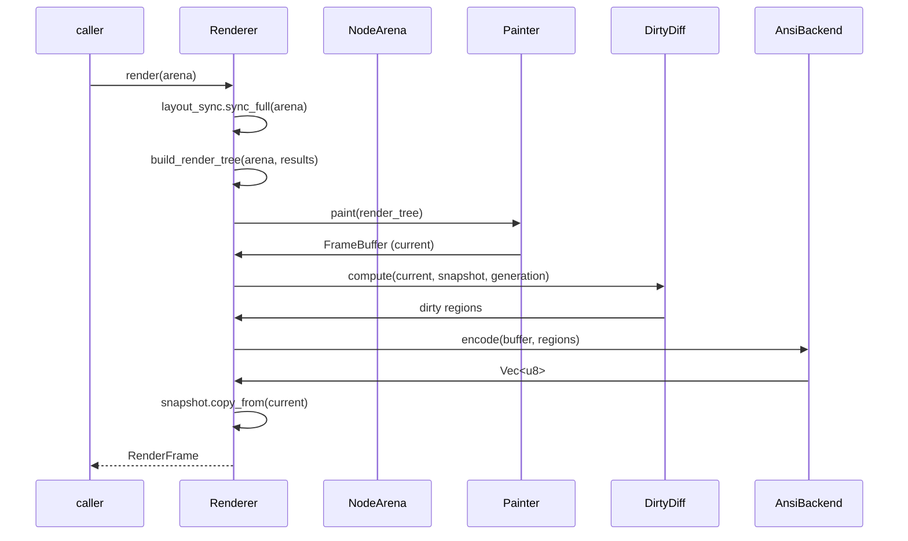
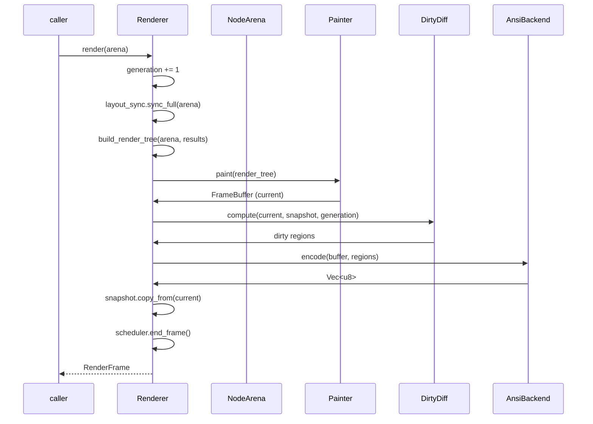

# Rendering Pipeline

The rendering pipeline turns the arena node tree into ANSI bytes on stdout. It lives mostly in the `renderer`, `render_object`, `painter`, `framebuffer`, and `dirty_diff` modules.

## Stages


Files: `renderer/mod.rs` (`Renderer`), `renderer/backend/ansi.rs` (`AnsiBackend`), `render_object/` (`build_render_tree`, `RenderTree`, `PaintContext`), `painter/` (`Painter`), `framebuffer/`, `dirty_diff/`.

## Renderer

```rust
pub struct Renderer {
    pub width: u16,
    pub height: u16,
    layout_sync: LayoutTreeSync,
    render_tree: RenderTree,
    painter: Painter,
    snapshot: FrameBuffer,         // previous frame
    dirty_diff: DirtyDiff,
    backend: Box<dyn RenderBackend>,
    scheduler: Scheduler,
    needs_full_repaint: bool,
    generation: u64,
}
```

Key methods: `new`, `with_backend`, `with_fps`, `resize`, `request_frame`, `should_render() -> FrameStatus`, `render(&NodeArena) -> RenderFrame`, `render_full`, `framebuffer()`, `layout_sync()`, `scheduler()`, `dimensions()`.

`RenderFrame` carries `output_data: Vec<u8>`, `dirty_regions: Vec<DirtyRegion>`, `width`, `height`.

## Frame lifecycle



## Backend

`RenderBackend` is a trait so alternative output targets are possible. The only implementation today is `AnsiBackend`, which walks dirty regions in reading order and emits minimal cursor moves + SGR + characters.

```rust
pub trait RenderBackend {
    fn encode(&mut self, buffer: &FrameBuffer, regions: &[DirtyRegion]);
    fn finish(&self) -> &[u8];
    fn reset(&mut self);
}
```

## Frame lifecycle (v1)



Key changes from pre-v1:
- `generation` is incremented at **start** of render (correct for DirtyDiff caching)
- `scheduler.end_frame()` called at end for frame budget tracking
- `scheduler.begin_frame()` removed from renderer (caller decides when to render)

## Performance characteristics

- **Double buffering:** `snapshot` buffer holds previous frame; cells are diffed, not re-encoded wholesale.
- **Generation caching:** DirtyDiff returns cached regions if generation unchanged (avoids full scan).
- **Row-scan diff:** `compute_dirty_regions` scans row-by-row, builds horizontal runs, merges into regions on-the-fly. No intermediate `Vec<(u16,u16)>` allocation (pre-v1 allocated up to W*H tuples).
- **Grid-free merge:** No O(W*H) boolean grid allocation (pre-v1 allocated 2x `Vec<bool>` grids for merge algorithm).
- **Post-merge pass:** Adjacent regions are merged after initial detection for fewer, larger regions.
- **Style coalescing:** AnsiBackend uses run-length batching — consecutive cells with matching style are batched into a single SGR sequence + character run, avoiding per-cell SGR overhead.
- **`move_to` uses stack buffer:** No `format!()` heap allocation per row (pre-v1 used `format!` for cursor positioning).
- **Early exit:** If DirtyDiff generation matches, regions from previous frame are reused.
- **Full repaint fallback:** Single region covering entire terminal when `needs_full_repaint` is set.
