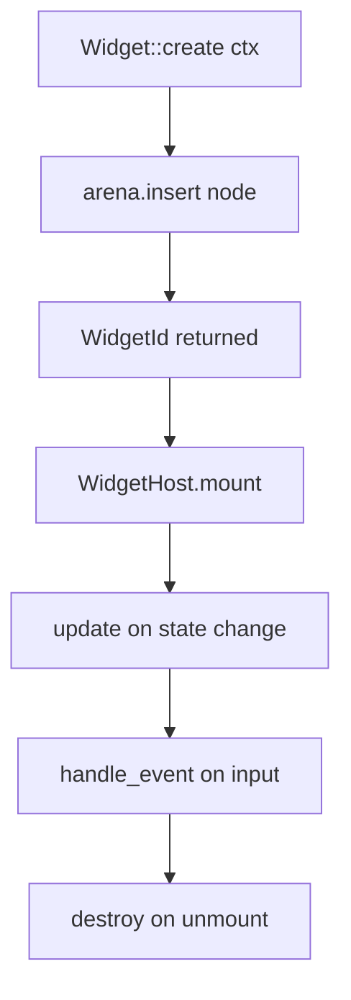

# Widget Model

Widgets are the high-level, composable UI layer built on top of the arena. Code: `packages/core/crates/engine/src/widgets/` (~200 tests across 30+ files).

## Trait

```rust
pub trait Widget: Send + Sync {
    fn kind() -> &'static str;
    fn create(&self, ctx: &mut WidgetContext) -> WidgetId;
    fn update(&self, ctx: &mut WidgetContext, id: WidgetId);
    fn handle_event(&self, ctx: &mut WidgetContext, id: WidgetId, event: &Event) -> EventResult;
    fn destroy(&self, ctx: &mut WidgetContext, id: WidgetId);
}
```

- `WidgetId(pub NodeId)` — a tuple struct: construct `WidgetId(node_id)`.
- `WidgetContext<'_> { arena: &mut NodeArena, focus_manager: &mut FocusManager, scheduler: &mut Scheduler, terminal_size, theme: &Theme }`.
- `enum WidgetLifecycle { Create, Mount, Update, Destroy }`.



## Host & registry

- `WidgetHost { tree: WidgetTree, registry: WidgetRegistry, widgets, widget_map }`: `register`, `mount`, `unmount`, `handle_event`, `update`, `widget_count`.
- `WidgetRegistry`, `Pipeline`, `enum ReconcileOp`, `Reconciler`, `WidgetTree`, `Theme`/`SpacingToken`/`ThemeToken`, `AppState`.

## Built-in widgets

`BoxWidget`, `FlexWidget` (uses `FlexDirection::Column`), `ContainerWidget`, `StackWidget`, `GridWidget`, `TextWidget`, `LabelWidget`, `ButtonWidget`, `BadgeWidget`, `HeadingWidget`, `InputWidget`, `TextareaWidget`, `ModalWidget`, `TabsWidget`, `TooltipWidget`, `SpinnerWidget`, `ProgressWidget`, `CodeWidget`, `ScrollAreaWidget`, `SeparatorWidget`, `SpacerWidget`, `PromptComposer`/`ComposerState`. Plus submodules: `chat/` (`ChatView`, `Message`, `Role`, …) and `markdown/` (`MarkdownParser`, `MarkdownNode`, `MarkdownRenderer`).

Structs that need Default must derive it (per project rules — e.g. `BoxWidget`/`ContainerWidget`).

## Status

The Rust widget framework is substantial and tested. The TypeScript `@bettertui/widgets` package, however, is **proposed but does not exist yet** — there is no `packages/widgets` directory. There is no TS-side widget implementation yet.
