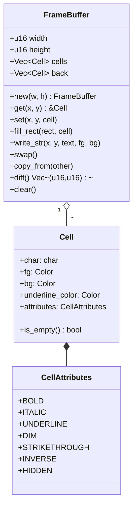
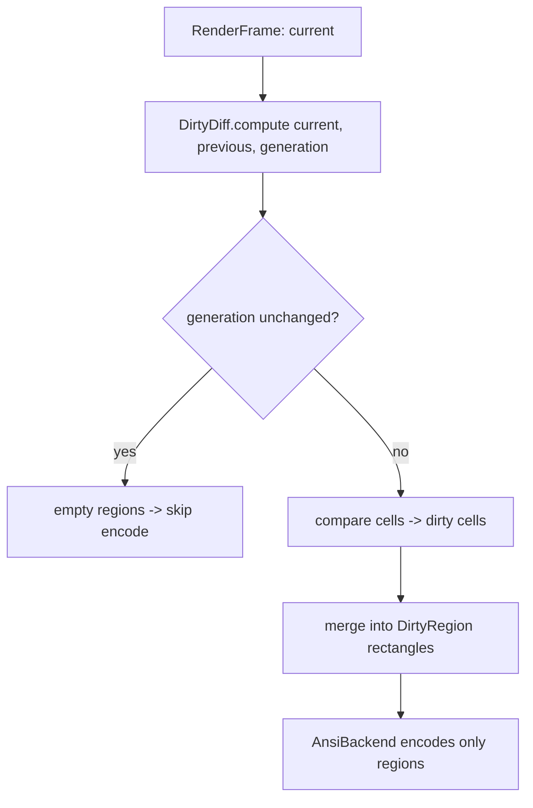

# Frame Buffer

The frame buffer is the cell grid the renderer writes into and diffs against the previous frame. Code: `packages/core/crates/engine/src/framebuffer/`. Dirty-region diffing: `packages/core/crates/engine/src/dirty_diff/`.

## Structure

- `Cell` is `Copy`. `get()` returns a static `EMPTY` cell when out of bounds (never `Option`) — out-of-bounds writes are silently ignored.
- `CellAttributes` is a `bitflags` type (one byte).
- `Color` stores intent (`Named`/`Indexed`/`Rgb`/`Default`); resolved to the terminal's best representation only at encode time.

## Dirty-region diffing

- `DirtyRegion { x, y, width, height: u16 }` with `merge`, `intersects`, `contains`, `can_merge_horizontal/vertical`, `area`.
- `DirtyDiff { regions, last_generation }`; `compute_full_repaint(w, h)` for full repaints.

## ANSI encoding

The `AnsiBackend` (in `render/render.rs`) produces ANSI bytes:
- cursor moves (`ESC[{row};{col}H`, plus relative moves for short hops)
- SGR for colors/attributes, with style coalescing so adjacent same-style cells share one sequence
- character output, cursor hide/show around the write

> Width handling: CJK/emoji occupy 2 cells; `unicode-width` drives measurement. Combining characters are currently rendered as separate cells (full combining support is future work).
