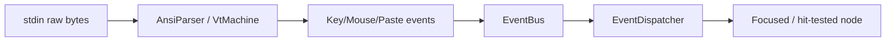
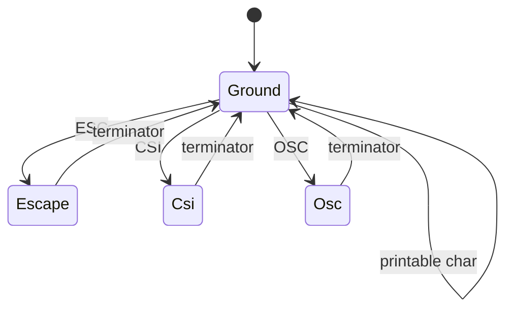

# Input System

The input system turns raw terminal bytes into structured events. Raw-byte parsing lives in `packages/core/crates/engine/src/input.rs` (the `input` module) and `packages/core/crates/engine/src/ansi.rs`; the engine's `terminal/vt.rs` module and the `input` module's keymap types provide keybinding handling and hit-testing on top of the parsed input.

## Flow

## Keyboard

- `input.rs`: `KeyboardInput { key: char, modifiers, action }`, `KeyAction`, `KeyModifiers` (bitflags SHIFT/CTRL/ALT/SUPER).
- Escape sequences: arrows, F-keys, Home/End, PageUp/Down, modifier combos (`ESC[1;2A` = Shift+Up).
- **Kitty keyboard protocol** (`CSI > 31 u`): key release, full modifier state, distinct ESC key. Parsed in the engine's `terminal/vt.rs` via `KittyKeyEvent::to_keyboard_input()`.

## Mouse

- `input.rs`: `MouseEvent`, `MouseButton`, `MouseInput`.
- X10 (`ESC[?9h`) and SGR (`ESC[?1006h`) protocols. SGR is preferred (coordinates > 223, button release).
- Button encoding: `0/1/2` = left/middle/right, `+64` = scroll up, `+65` = scroll down, plus modifier bits.

## Paste

Bracketed paste (`ESC[?2004h`, wrapped in `ESC[200~` ... `ESC[201~`) is collected into a `PasteEvent`.

## ANSI parser (`ansi.rs`)

The `AnsiParser` is a state machine (Ground, Escape, Csi, Osc, Dcs, Pm, Sos, Apc) producing `ParserEvent`s:

- `CsiCommand`, `OscCommand` (incl. `ClipboardData`, `Hyperlink`), `SgrState`.
- `AnsiEncoder` (in `ansi.rs`) reverses the flow: frame buffer → ANSI bytes, used by the renderer backend.

> Known issue: the `AnsiParser` + `VtMachine` are only wired into tests today — the production PTY read path does not yet feed bytes through them.
