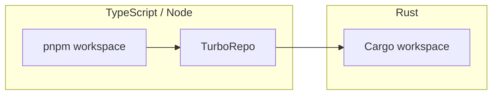
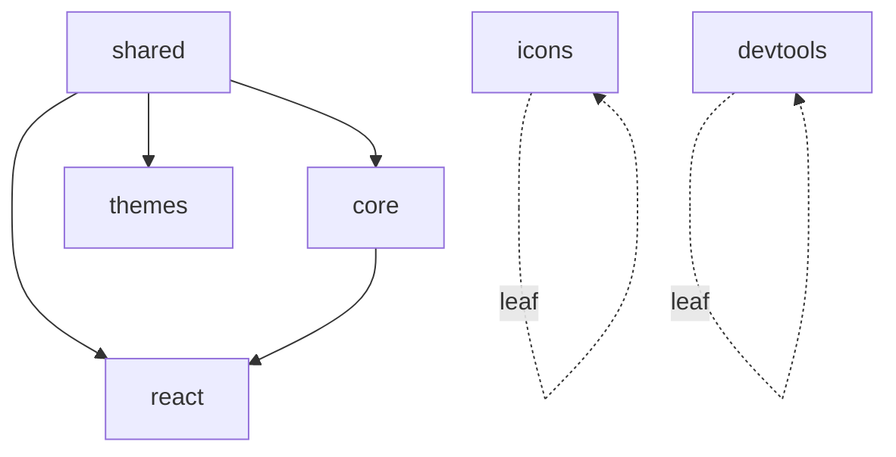
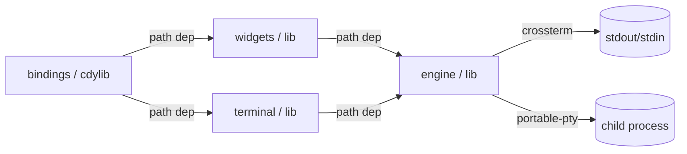
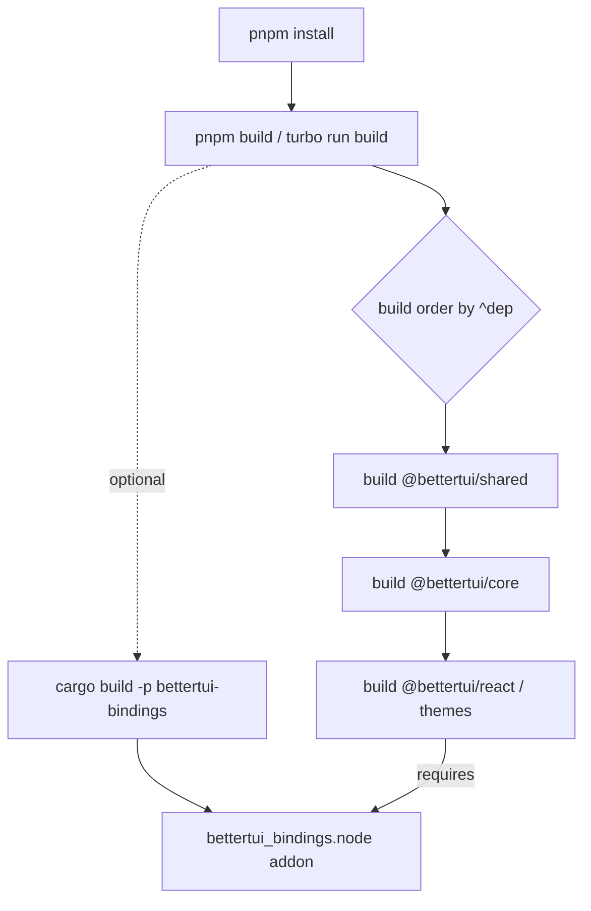
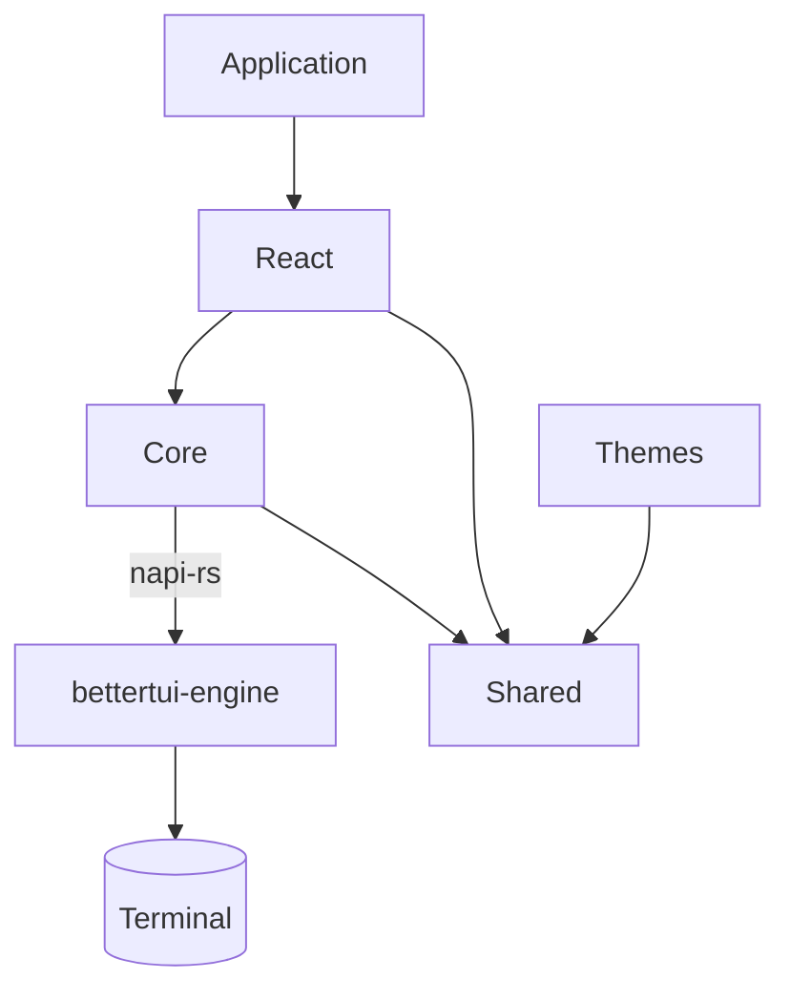

# Repository Overview

This document describes the physical and logical structure of the BetterTUI repository as it exists today. It is the entry point for understanding the codebase before reading any other module.

## Workspaces

BetterTUI is a single repository managed by three workspace systems:



- **pnpm workspace** (`pnpm-workspace.yaml`) declares the publishable/linked packages:
  - `apps/*`
  - `packages/*`
  - `packages/core/crates/bindings` (the napi-rs cdylib)
  - `examples/*`
- **TurboRepo** (`turbo.json`) orchestrates `build`, `dev`, `lint`, `format`, `format:check`, `typecheck`, `clean`. `build`/`lint`/`typecheck` depend on `^build`/`^lint`/`^typecheck` so dependencies build before dependents.
- **Cargo workspace** (`packages/core/Cargo.toml`, `resolver = "2"`) contains the three Rust crates:
  - `packages/core/crates/engine` → `bettertui-engine` (the library)
  - `packages/core/crates/widgets` → `bettertui-widgets` (widget framework, depends on engine)
  - `packages/core/crates/bindings` → `bettertui-bindings` (the napi-rs cdylib)

> Note: `packages/core/crates/engine` is **not** in `pnpm-workspace.yaml` (it is pure Rust). `apps/website` is TypeScript but is a docs site, not part of the framework.

## Directory Layout

```
bettertui/
├── packages/
│   ├── shared/        # @bettertui/shared  — type-only foundation (zero runtime code)
│   ├── core/          # @bettertui/core    — command protocol, tree ops, runtime, native bridge
│   │   └── crates/
│   │       ├── engine/        # bettertui-engine (Rust library) — rendering, layout, input, etc.
│   │       └── bindings/      # bettertui-bindings (Rust cdylib) — napi-rs FFI surface
│   ├── react/         # @bettertui/react   — React 19 adapter
│   ├── themes/        # @bettertui/themes  — theme defs + factory
│   ├── devtools/      # @bettertui/devtools — devtools stub
│   └── benchmark/     # @bettertui/benchmark — TS benchmark harness
├── apps/
│   └── website/       # @bettertui/website — Astro/Starlight docs + landing site
├── examples/          # @bettertui/examples — single package with runnable TSX demos
├── docs/              # this documentation
├── scripts/           # repo-level automation (doc checks, example smoke tests)
├── tasks/             # PRDs, reports, archived history (read-only)
├── Cargo.lock
├── package.json       # root TS manifest + pnpm scripts
├── pnpm-workspace.yaml
├── turbo.json
├── biome.json         # Biome config (TS/JS/JSON lint+format)
└── tsconfig.json
```

## TypeScript Package Layout

All TypeScript packages are ESM-only, built with `tsdown` (`dts: true`), and export their public API from a single `src/index.ts`.

| Package | `private` | Depends on | Role |
|---------|-----------|-----------|------|
| `@bettertui/shared` | yes | — | Pure type definitions (no runtime code) |
| `@bettertui/core` | yes | `shared` | Framework-agnostic command buffer, tree ops, reconciler wrapper, runtime, internal native bridge |
| `@bettertui/react` | yes | `core`, `shared`, `react-reconciler` | React 19 adapter (host config, hooks, 53 component exports) |
| `@bettertui/themes` | yes | `shared` | `defaultTheme`, `createTheme()` |
| `@bettertui/devtools` | yes | — | `createDevTools()` returns `null` (stub) |
| `@bettertui/benchmark` | yes | `core` | Vitest benchmarks for TS packages |




## Rust Crate Layout

| Crate | Type | Purpose |
|-------|------|---------|
| `bettertui-engine` | `lib` | Core engine: tree, layout, renderer, framebuffer, events, input, animation, pty, text, scheduler, etc. |
| `bettertui-widgets` | `lib` | Widget framework: Widget trait, WidgetContext, all built-in widgets. Depends on `bettertui-engine`. |
| `bettertui-terminal` | `lib` | Terminal interaction: crossterm I/O, VT emulation, PTY process management, neovim, capability detection. Depends on `bettertui-engine`. |
| `bettertui-bindings` | `cdylib` | napi-rs FFI surface exposing the engine + widgets + terminal to Node.js. Thin translation layer only. |

The bindings crate depends on both `bettertui-engine` and `bettertui-widgets` and contains **no** Rust unit tests — all verification lives in `bettertui-engine` and `bettertui-widgets` plus the TS layer above.



## Build System



Key root scripts:

| Script | Command |
|--------|---------|
| `pnpm build` | `turbo run build` |
| `pnpm lint` | `turbo run lint` (Biome) |
| `pnpm typecheck` | `turbo run typecheck` |
| `pnpm format` / `format:check` | Biome format (cache disabled) |
| `pnpm check` | lint + format:check + typecheck + `cargo:check` |
| `pnpm cargo:check/test/fmt/clippy` | Cargo passthroughs |

The Rust addon (`bettertui_bindings`) is **not** declared in any package.json — `@bettertui/core` loads `require("bettertui_bindings")` at runtime and throws a clear error if the addon was not built first (`cargo build -p bettertui-bindings`).

## Dependency Direction (the rule)



Rules enforced by code, not just policy:
- `bettertui-engine` must never import any JS framework.
- `@bettertui/core` must never import React.
- Only `@bettertui/react` imports React.
- The only boundary between a UI framework and the engine is the **command** — so adding Vue/Solid/Svelte/vanilla-TS adapters requires no Rust changes.

## Architecture Layers

```mermaid
graph TD
    subgraph L1[Framework Adapter Layer — TypeScript]
        R[@bettertui/react]
    end
    subgraph L2[Core TypeScript Layer]
        C[@bettertui/core]
        S[@bettertui/shared]
    end
    subgraph L3[Rust Crate Layer]
        E[bettertui-engine]
        W[bettertui-widgets]
        T[bettertui-terminal]
    end
    subgraph L4[Terminal]
        X[crossterm / portable-pty]
    end
    R --> C
    C -->|napi-rs| E
    W -->|path dep| E
    T -->|path dep| E
    E --> X
```

- **Layer 1 (React adapter).** Translates React's virtual DOM operations into core `Command`s via a `react-reconciler` host config.
- **Layer 2 (Core TypeScript).** Owns the command protocol, tree manipulation, runtime/frame loop, and the native bridge.
- **Layer 3 (Rust engine).** The `bettertui-engine` crate owns the arena, layout, rendering, events, input, animation, text, PTY. The `bettertui-terminal` crate handles terminal I/O, VT emulation, and capability detection. The `bettertui-widgets` crate provides built-in composable UI widgets.
- **Layer 4 (Terminal).** Raw bytes in/out via crossterm and child processes via portable-pty.
pty.
