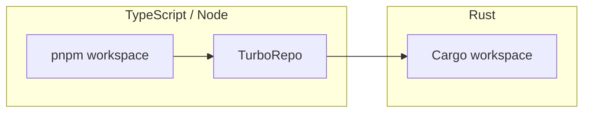
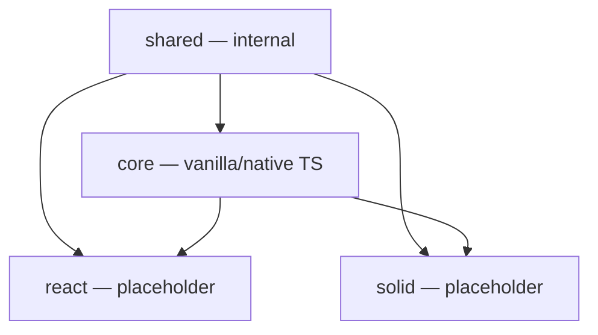
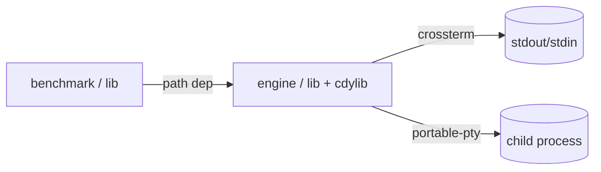
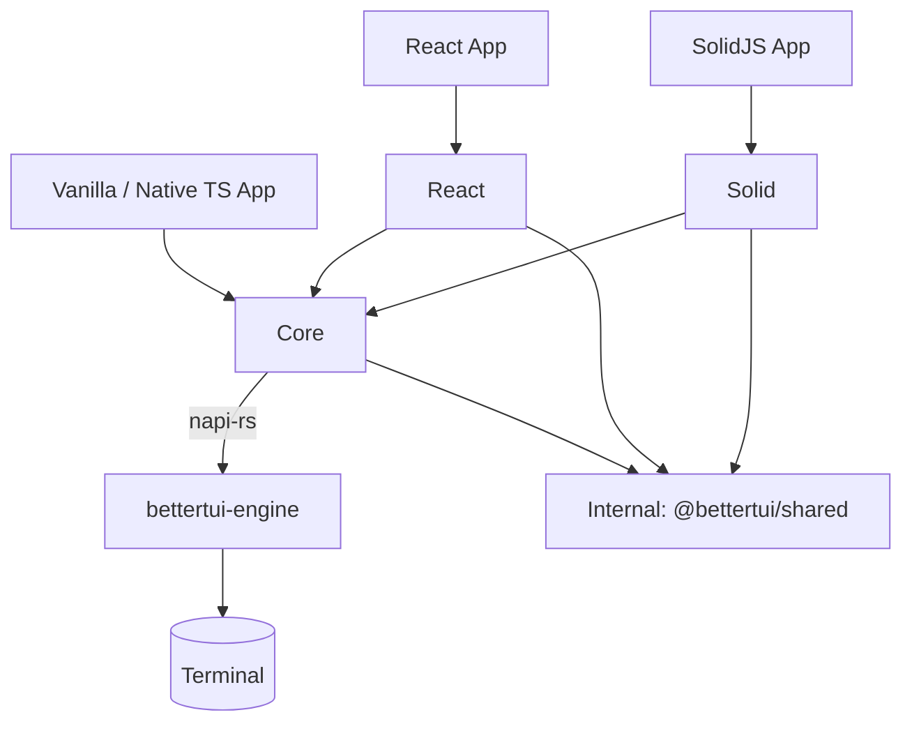

# Repository Overview

This document describes the physical and logical structure of the BetterTUI repository as it exists today. It is the entry point for understanding the codebase before reading any other module.

## Workspaces

BetterTUI is a single repository managed by three workspace systems:



- **pnpm workspace** (`pnpm-workspace.yaml`) declares the publishable/linked packages:
  - `apps/*`
  - `packages/*`
  - `examples/*`
- **TurboRepo** (`turbo.json`) orchestrates `build`, `dev`, `lint`, `format`, `format:check`, `typecheck`, `clean`. `build`/`lint`/`typecheck` depend on `^build`/`^lint`/`^typecheck` so dependencies build before dependents.
- **Cargo workspace** (`packages/core/Cargo.toml`, `resolver = "2"`) contains the Rust crates:
  - `packages/core/crates/engine` → `bettertui-engine` (lib + cdylib `bettertui_engine.node` + `layout_e2e` bin)
  - `packages/core/crates/logger` → `bettertui-logger` (tracing logger)
  - `packages/core/crates/benchmark` → `bettertui-benchmark` (Rust bench harness)
> Note: `packages/core/crates/engine` is **not** in `pnpm-workspace.yaml` (it is pure Rust). `apps/website` is TypeScript but is a docs site, not part of the framework. Terminal I/O, VT emulation, PTY, capabilities, and the widget host are **modules inside `bettertui-engine`** — there is no `bettertui-widgets`, `bettertui-terminal`, or `bettertui-bindings` crate.

## Directory Layout

```
bettertui/
├── packages/
│   ├── shared/        # @bettertui/shared  — type-only foundation (zero runtime code, internal)
│   ├── core/          # @bettertui/core    — command protocol, tree ops, runtime, native bridge
│   │   └── crates/                    # Rust workspace (packages/core/Cargo.toml)
│   │       ├── engine/        # bettertui-engine (lib + cdylib + layout_e2e bin) — the native addon
│   │       ├── logger/        # bettertui-logger (tracing logger for native code)
│   │       └── benchmark/     # bettertui-benchmark (Rust bench harness)
│   ├── react/         # @bettertui/react   — React 19 adapter
│   └── benchmark/     # @bettertui/benchmark — TS benchmark harness
├── apps/
│   └── website/       # @bettertui/website — Astro/Starlight docs + landing site
├── examples/
│   └── vanilla/       # Vanilla / native TypeScript examples (run on @bettertui/core)
├── docs/              # this documentation
├── scripts/           # repo-level automation (doc checks, example smoke tests)
├── tasks/             # PRDs, reports, archived history (read-only)
├── Cargo.lock
├── package.json       # root TS manifest + pnpm scripts
├── pnpm-workspace.yaml
├── turbo.json
├── biome.json         # Biome config (TS/JS/JSON lint+format)
└── tsconfig.json
```

## TypeScript Package Layout

All TypeScript packages are ESM-only, built with `tsdown` (`dts: true`), and export their public API from a single `src/index.ts`. All packages are currently `private` (not published to npm).

| Package | `private` | Depends on | Role |
|---------|-----------|-----------|------|
| `@bettertui/shared` | yes | — | Pure type definitions (no runtime code) — **internal, re-exported by `@bettertui/core`** |
| `@bettertui/core` | yes | `shared` | Framework package for vanilla / native TypeScript — command buffer, tree ops, reconciler wrapper, `CommandRuntime`, native bridge, in-core debug tooling (`createDevTools`, debug overlay) |
| `@bettertui/react` | yes | `core`, `shared` | **Placeholder** — React adapter not yet implemented |
| `@bettertui/solid` | yes | `core`, `shared` | **Placeholder** — SolidJS adapter not yet implemented |
| `@bettertui/benchmark` | yes | `core` | Vitest benchmarks for TS packages |




## Rust Crate Layout

The Rust workspace root is `packages/core/Cargo.toml`. Its members:

| Crate | Type | Purpose |
|-------|------|---------|
| `bettertui-engine` | `lib` + `cdylib` + `bin` | Core engine: `tree`, `input`, `animation`, `ansi`, `dirty_diff`, `engine`, `ffi`, `font`, `framebuffer`, `glyph`, `graphics`, `taffy`, `plugin`, `protocol`, `pty`, `render`, `scheduler`, `syntax`, `terminal`, `text`, `theme`. With the `napi` feature it builds as the `bettertui_engine.node` addon. |
| `bettertui-logger` | `lib` | File-based tracing logger for native code. |
| `bettertui-benchmark` | `lib` | Rust benchmark harness (`publish = false`). |

Terminal I/O, VT emulation, PTY, capabilities, and neovim support are **submodules of
`bettertui-engine`** (under `terminal/` and `pty.rs`) — there is no separate `bettertui-terminal`
crate. The widget host is exposed from the native bridge (`createWidgetHost`), not a
`bettertui-widgets` crate. There is no `bettertui-bindings` crate: the engine crate itself is the
napi surface.

The engine's source is mostly flat files (`tree.rs`, `input.rs`, `taffy.rs`, …) with four
subdirectories: `render/` (`mod.rs`, `render.rs`, `effects.rs`), `text/`, `font/`, and
`terminal/`. There is no `renderer/`, `events/`, `compositor/`, `screen/`, or `capabilities/`
directory — event dispatch, compositor primitives, screen state, and capability detection live
inside `input.rs`, `tree.rs`, `graphics.rs`, and `terminal/` respectively.



## Build System

```mermaid
flowchart TD
    A[pnpm install] --> B[pnpm build / turbo run build]
    B --> C{build order by ^dep}
    C --> D[build @bettertui/shared (internal)]
    D --> E[build @bettertui/core]
    B -. optional .-> G[pnpm --filter @bettertui/core build:native]
    G --> H[bettertui_engine.node addon]
    E -->|requires| H
```

Key root scripts:

| Script | Command |
|--------|---------|
| `pnpm build` | `turbo run build` |
| `pnpm lint` | `turbo run lint` (Biome) |
| `pnpm typecheck` | `turbo run typecheck` |
| `pnpm format` / `format:check` | Biome format (cache disabled) |
| `pnpm check` | lint + format:check + typecheck + `cargo:check` |
| `pnpm cargo:check/test/fmt/clippy` | Cargo passthroughs |

The Rust addon (`bettertui_engine.node`) is **not** declared in any package.json — `@bettertui/core` loads `require("bettertui_engine")` at runtime and throws a clear error if the addon was not built first (`pnpm --filter @bettertui/core build:native`, which runs `napi build --manifest-path crates/engine/Cargo.toml --features napi`).

## Dependency Direction (the rule)



Rules enforced by code, not just policy:
- `bettertui-engine` must never import any JS framework.
- `@bettertui/core` must never import React.
- Only `@bettertui/react` imports React.
- The only boundary between a UI framework and the engine is the **command** — so adding Vue/Solid/Svelte/vanilla-TS adapters requires no Rust changes.

## Architecture Layers

```mermaid
graph TD
    subgraph L1[App-Facing Packages — TypeScript]
        VR[Vanilla / Native TS App]
        C[@bettertui/core — first-class, framework-agnostic]
        AR[React App]
        R[@bettertui/react — placeholder, depends on core]
        SR[SolidJS App]
        S[@bettertui/solid — placeholder, depends on core]
    end
    subgraph L2[Type Foundation]
        TF[@bettertui/shared — internal, re-exported]
    end
    subgraph L3[Rust Crate Layer]
        E[bettertui-engine — lib + cdylib]
    end
    subgraph L4[Terminal]
        X[crossterm / portable-pty]
    end
    VR --> C
    AR --> R
    SR --> S
    R --> C
    S --> C
    C -->|napi-rs| E
    E --> X
    C --> TF
    R --> TF
    S --> TF
```

- **Layer 1 (App-facing packages).** `@bettertui/core` is the framework package for vanilla / native TypeScript. `@bettertui/react` is the React adapter and depends on core — React apps install only `@bettertui/react`.
- **Layer 2 (Core TypeScript).** Owns the command protocol, tree manipulation, `CommandRuntime`/frame loop, and the native bridge.
- **Layer 3 (Rust engine).** The `bettertui-engine` crate (a single crate) owns the arena, layout (Taffy), rendering, events, input, animation, text, PTY, terminal I/O, VT emulation, capability detection, and the widget host — all as modules within the one crate.
- **Layer 4 (Terminal).** Raw bytes in/out via crossterm and child processes via portable-pty.
