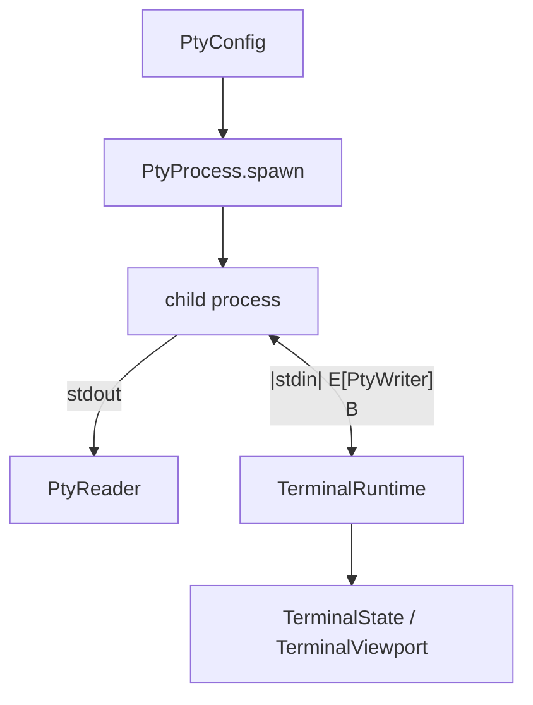

# PTY

BetterTUI can embed a real terminal process (shell, REPL, etc.) via a PTY. PTY types: `packages/core/crates/engine/src/pty.rs`. Process management: `packages/core/crates/engine/src/terminal/process.rs`.

## Components

## pty module

| Type | Purpose |
|------|---------|
| `PtyConfig { program, args, env: Vec<(String,String)>, working_directory, size: PtySize }` | spawn configuration (note: `working_directory`, not `working_dir`; `env` is a `Vec`) |
| `PtySize { cols, rows, pixel_width, pixel_height }` | dimensions |
| `PtyProcess` | `spawn(config)` (size lives in config), `read`, `write`, `resize`, `is_running(&mut self)`, `exit_status`, `kill`, `wait`, `pid` |
| `PtyRuntime` | facade over `PtyProcess` |
| `PtyReader` / `PtyWriter` | stream wrappers |
| `PtyError` | `SpawnFailed`, `ResizeFailed`, `ReadFailed`, `WriteFailed`, `KillFailed`, `NotRunning`, `ProcessExited(i32)` |

Built on `portable-pty`.

## Terminal process management (engine `terminal/process.rs`)

`TerminalRuntime` manages the spawned process lifecycle:

- `spawn`, `read`, `write`, `resize`, `is_running`, `kill`, `wait`.
- `is_running()` checks its own `TerminalState`, **not** `PtyProcess::is_running()` (per the project memory).
- `ProcessConfig`, `ProcessSpawner { ProcessConfigBuilder }`, `SpawnResult`, `enum ProcessStatus`, `TerminalState`, `TerminalViewport { cols, rows, scroll }`, `enum ScrollMode`.
- `TerminalError` chains `PtyError -> TerminalError` via `From`.

The `TerminalViewport` and `scrollback` feed the `screen` and `compositor` modules.
