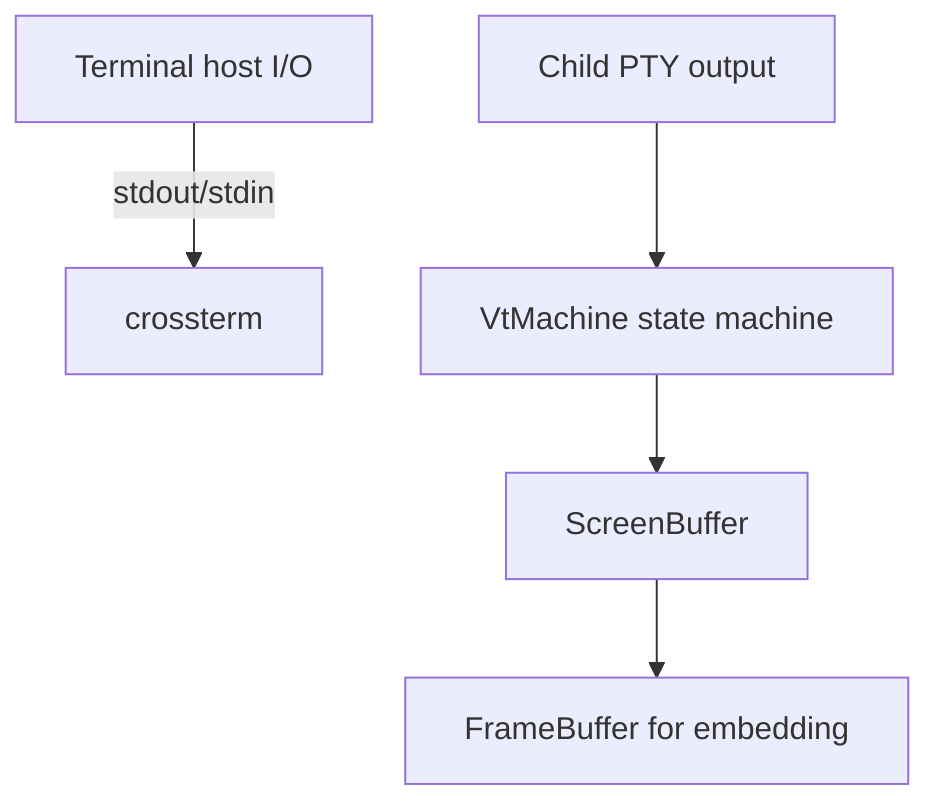
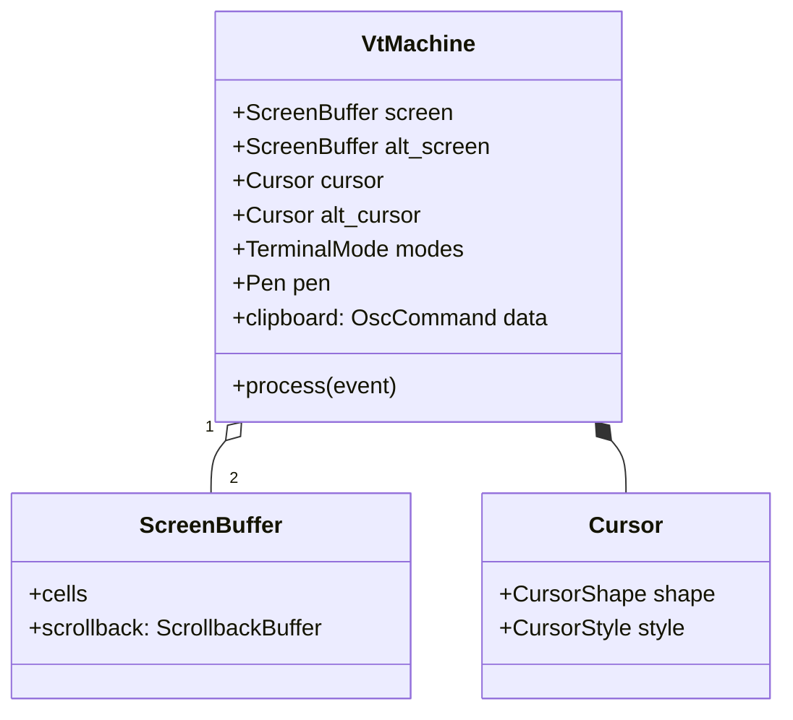

# Terminal

This document covers host-terminal I/O (raw mode, alternate screen, queries) and the embedded VT state machine. Code: `packages/core/crates/terminal/src/` (the `bettertui-terminal` crate). The crate is a flat set of files: `lib.rs`, `capabilities.rs`, `neovim.rs`, `process.rs`, `query.rs`, `screen.rs`, `scrollback.rs`, `vt.rs`.

## Two layers

- **Host I/O** (`lib.rs`): `Terminal::enter_raw_mode`, `leave_raw_mode`, `enter/leave_alternate_screen`, `clear`, `hide/show_cursor`, `move_cursor`, `write_bytes`, `poll_event(timeout) -> Option<TerminalEvent>`. `Drop` restores terminal state.
- **VT emulation** (`vt.rs`): `VtMachine` consumes `ParserEvent`s (from the engine `ansi` parser) and maintains screen state — used to render an embedded shell.

## Terminal struct

| Member | Purpose |
|--------|---------|
| `enter_raw_mode` / `leave_raw_mode` | disable line buffering/cooking |
| `enter_alternate_screen` / `leave_alternate_screen` | swap to the alt buffer |
| `clear` | erase screen |
| `hide_cursor` / `show_cursor` | visibility |
| `move_cursor(x, y)` | absolute cursor placement |
| `write_bytes(&[u8])` | raw output |
| `poll_event(timeout) -> Option<TerminalEvent>` | read key/mouse/resize |
| `Key { Char, Enter, Esc, F(u8), ... }` | host key model |

## Capability querying

The terminal crate's `query.rs` defines `TerminalQuery` (DA1/DA2/DA3/DSR/DECID/XTVersion/Kitty), `QueryResult`, `full_probe_queries()`, and `check_responses(&VtMachine)`. Results feed `capabilities::CapabilityDetector`.

## VT machine (`vt.rs`)

`vt.rs` defines `VtMachine`, `process(&ParserEvent)`, `KittyKeyEvent::to_keyboard_input()`, `TerminalResponse`/`ResponseKind`, `Cursor`/`CursorShape`/`CursorStyle`, `TerminalMode`/`PrivateMode`, and `ScreenBuffer`/`Pen`/`ScrollbackBuffer`.

The screen state (in `screen.rs`) feeds the compositor and a `FrameBuffer` for embedding a live shell inside the UI.
