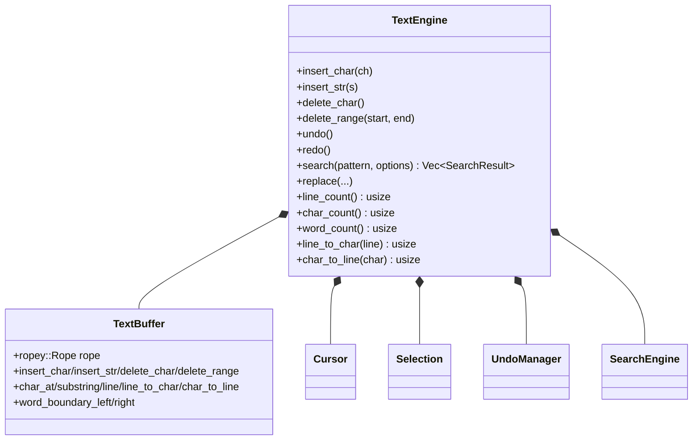

# Text Editing

BetterTUI ships a rope-based text editor engine, exposed directly to TypeScript as `NapiTextEngine` (no arena dependency). Core text primitives live in `packages/core/crates/engine/src/text/`; the `text` module (in `text.rs`) exposes `TextEngine` with cursor, selection, undo/redo, and line numbers built on top of the `text/` submodules.

## Engine

- `TextBuffer` wraps `ropey::Rope` — efficient editing at any position.
- `Cursor` tracks the caret position.
- `SearchEngine` / `SearchOptions` / `SearchResult` handle find.
- `Selection` / `SelectionRange` handle ranges.
- `UndoManager` with `enum UndoAction`.

## TypeScript surface

`@bettertui/core` exposes `NapiTextEngine` (~25 methods):

| Group | Methods |
|-------|---------|
| Insert | `insertChar`, `insertStr`, `insertText`, `insertAt` |
| Cursor | `cursorLeft/Right/Up/Down`, `cursorLineStart/End`, `cursorPosition`, `setCursorPosition` |
| Delete | `deleteChar`, `deleteCharForward`, `deleteWordBackward/Forward`, `deleteLineBackward/Forward` |
| Query | `charAt`, `substring`, `find`, `replaceAll`, `canUndo`, `canRedo`, `length`, `text`, `lines`, `lineCount`, `isEmpty`, `clear` |

> The selection concept also exists at the screen level (terminal crate's `screen.rs` `selection_*`) for terminal text selection, separate from the `text/selection.rs` submodule.
