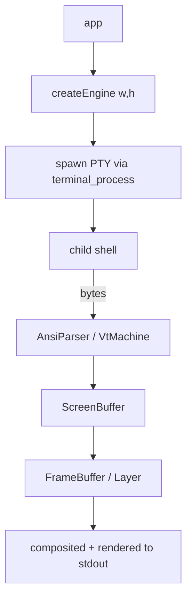

# Terminal & PTY

BetterTUI can embed a live terminal process (shell, REPL) inside the UI via a PTY, and it can parse/emit ANSI through a VT state machine. This is engine-level functionality exposed through `@bettertui/core`'s native bridge.

## Components

## What exists in the engine

- `pty/` — `PtyConfig`, `PtySize`, `PtyProcess` (`spawn`, `read`, `write`, `resize`, `is_running`, `kill`, `wait`, `pid`), `PtyRuntime`, `PtyReader`/`PtyWriter`, `PtyError`. Built on `portable-pty`.
- `terminal_process/` — `TerminalRuntime` (`spawn`/`read`/`write`/`resize`/`is_running`/`kill`/`wait`), `ProcessConfig`, `ProcessSpawner`, `SpawnResult`, `TerminalState`, `TerminalViewport`, `enum ScrollMode`.
- `terminal/vt/` — `VtMachine` consumes parser events and maintains `ScreenBuffer`/`Cursor`/`Pen`/`modes`. Produces a `FrameBuffer` for embedding.
- `screen/` — `ScreenState` with alternate screen, scrollback, and selection.

## TypeScript surface

`@bettertui/core`'s native bridge exposes factories `createEngine`, `createEventBus`, `createFocusManager`, `createTextEngine`, `createScheduler`, `detectCapabilities`, `getVersion`, and `createRuntime` (ties engine + event bus + core `CommandBuffer`). The PTY lifecycle is driven through the native engine's process API.

## Known gaps

- The `AnsiParser` + `VtMachine` are wired into tests but **not yet** into the production PTY read path (per the Phase 8 review). The embedded-terminal feature is implemented at the engine level but the end-to-end React "Terminal widget" is not exposed as a component yet.
