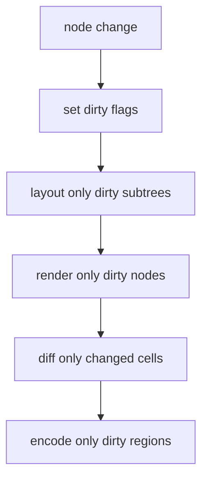

# Performance

Performance is a first-class concern. The engine targets 60fps with dirty-region optimization.

## Strategy

- **Dirty tracking** — arena `generation` + per-node `layout_dirty`/`render_dirty`. Skip work when nothing changed.
- **Layout caching** — Taffy caches per node; only dirty subtrees recompute.
- **Batch commands** — one FFI call per frame (amortized).
- **Frame diffing** — only changed cells written to terminal.
- **Style coalescing + cursor-move optimization** — minimal ANSI volume.

## Known issues (from the Phase 8 review)

1. `Painter::paint()` clears every cell before repainting (O(n) per frame) — needs region-based clearing.
2. `DirtyDiff::find_dirty_cells` does a full scan every frame — needs per-node dirty tracking.
3. `OSC` `String::from_utf8_lossy()` allocates — needs `&[u8]` parsing.
4. `Vec<SgrAttribute>` per SGR sequence — could use `SmallVec`.
5. `begin_frame()` called at end of `render()` and clears the priority queue; two frame counters (`Engine::frame_count` vs `Scheduler::frame_count`) are unsynchronized.

## Benchmarking

There is **no** benchmark harness yet — `benchmarks/` is an empty placeholder. CI runs `cargo test`, clippy, rustfmt, and the Turborepo TS tasks, but not `cargo bench`.

## Numbers (engine targets)

| Metric | Target |
|--------|--------|
| Frame rate | 60fps (16.67ms) |
| Layout (1000 nodes) | <5ms |
| Render (10000 cells) | <10ms |
| Input → event | <1ms |
