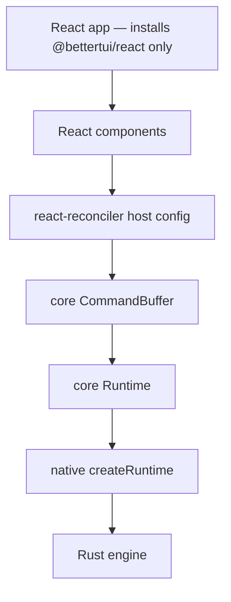
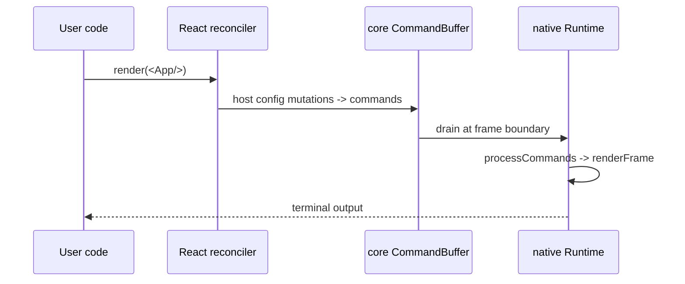

# React Adapter

`@bettertui/react` is the first (and currently only) framework adapter. It translates React's virtual DOM operations into core `Command`s.

**For React apps, install only `@bettertui/react`** — it depends on `@bettertui/core` and pulls it in automatically. You do **not** install core by hand for a React project. (If you don't use React, install `@bettertui/core` directly for vanilla / native TypeScript support.)

## Pieces

- **Reconciler** (`renderer.ts`): `createBetterTUIReconciler(buffer)`, `createContainer`, `updateContainer`. Host config in mutation mode over core `Instance`/`TextInstance`/`CommandBufferConsumer`.
- **Runtime** (`runtime.tsx`): `render(element) -> { root, runtime, dispose }`; `RuntimeProvider` + `useRuntime`.
- **Hooks** (`hooks/index.tsx`): `Provider`/`useTheme`, `FocusProvider`/`useFocus`, `useKeyboard`, `useMouse`, `TerminalProvider`/`useTerminal`, `useResize`, `useFrame`, `useClipboard`, `useAnimation`, `useTimeline`, `SelectionProvider`/`useSelection`, `CapabilitiesProvider`/`useCapabilities`, and the keymap suite (`KeymapProvider`/`useKeymap`, `useKeymapEvent`, `useActiveBindings`, `usePendingSequence`, `useCommand`, `useKeyIntercept`, `useKeymapMode`, re-exported `Keymap`).
- **Components**: **13 exported component functions** — `Box`, `Text`, `Code`, `Input`, `Textarea`, `Select`, `Slider`, `TabSelect`, `ScrollBar`, `ScrollBox`, `Markdown`, `Diff`, `TextTable`. Each emits an element descriptor via `createElement`. Full list in [`docs/api/packages/react.md`](api/packages/react.md).

## Lifecycle

## Theme note

`useTheme`'s `Theme`/`ThemeColors`/`ThemeSpacing` is React-authored and distinct from `@bettertui/shared`'s `Theme`. Map between them at the render boundary.

## Status

Renderer + hooks + runtime are real and wired. 13 component functions are exported. Dependencies: `core`, `shared`, `react-reconciler`; peer `react@^19`. Only `@bettertui/react` imports React. **React users install `@bettertui/react` and nothing else — core comes along automatically.**
