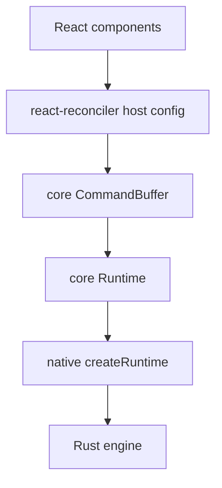
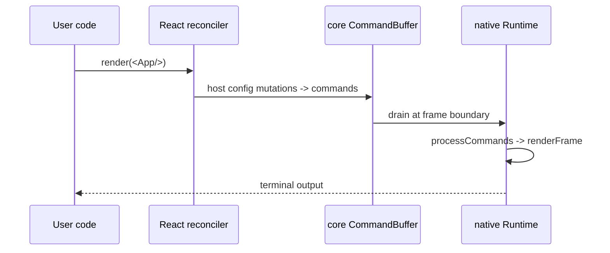

# React Adapter

`@bettertui/react` is the first (and currently only) framework adapter. It translates React's virtual DOM operations into core `Command`s.

## Pieces

- **Reconciler** (`renderer.ts`): `createBetterTUIReconciler(buffer)`, `createContainer`, `updateContainer`. Host config in mutation mode over core `Instance`/`TextInstance`/`CommandBufferConsumer`.
- **Runtime** (`runtime.tsx`): `render(element) -> { root, runtime, dispose }`; `RuntimeProvider` + `useRuntime`.
- **Hooks** (`hooks/index.tsx`): `Provider`/`useTheme`, `FocusProvider`/`useFocus`, `useKeyboard`, `TerminalProvider`/`useTerminal`, `useFrame`, `useClipboard`, `useAnimation`.
- **Components**: `Box, Text, Flex, Spacer, Button, Input, Textarea, Tabs, Modal, Badge, Progress, Spinner, Tooltip, Separator, Heading, Label, Code, Grid, Stack` and 50 more — **69 exported component functions**, each a thin wrapper that emits an element descriptor via `createElement`.

## Lifecycle

## Theme note

`useTheme`'s `Theme`/`ThemeColors`/`ThemeSpacing` is React-authored and distinct from `@bettertui/shared`'s `Theme`. Map between them at the render boundary.

## Status

Renderer + hooks + runtime are real and wired. 69 component functions are exported but are currently thin wrappers (emit element descriptors, not yet connected to a live native render loop). Dependencies: `core`, `shared`, `react-reconciler`; peer `react@^19`. Only `@bettertui/react` imports React.
