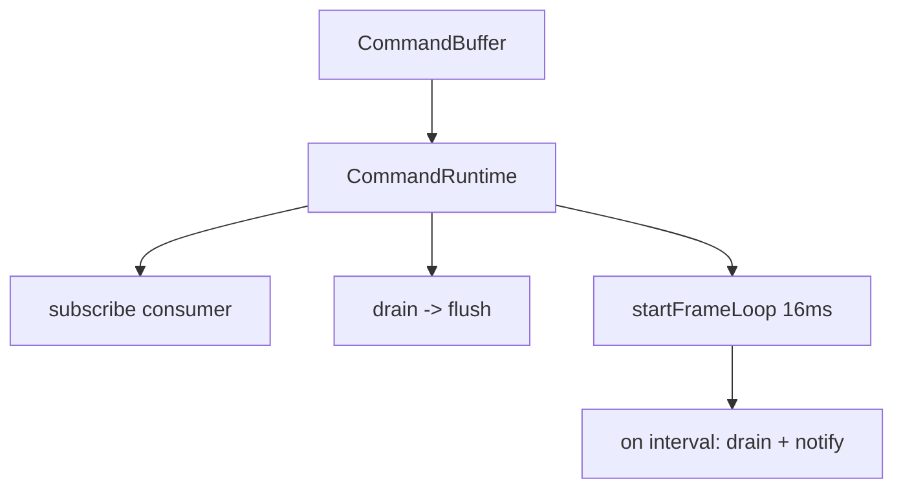

# Runtime

"Runtime" refers to the frame loop and command drain that tie the TypeScript command buffer to the Rust engine. There are two runtime constructs: one framework-agnostic in `@bettertui/core` (the public package for vanilla / native TypeScript), and one React-specific in `@bettertui/react`.

## Core Runtime (`@bettertui/core`)

`CommandRuntime` (exported from `@bettertui/core`) owns a `CommandBuffer` and:
- `subscribe(consumer)` — register a sink for drained commands
- `drain()` — pull accumulated commands
- `flush()` — notify subscribers
- `startFrameLoop(durationMs = 16)` / `stopFrameLoop()` — timed drain+flush
- `dispose()` — tear down

## React Runtime (`@bettertui/react`)

`render(element)` creates a `CommandRuntime`, a reconciler, and a container, then returns `{ root, runtime, dispose() }`. `RuntimeProvider` + `useRuntime()` expose the runtime to components for key handlers and frame control.

## Native bridge (`@bettertui/core`)

The native bridge (`packages/core/src/platform/`) loads the `bettertui_engine` addon and exposes `createEngine`, `createEventBus`, `createFocusManager`, `createTextEngine`, `createScheduler`, `createKeymap`, `detectCapabilities`, `getVersion`, plus `CliRenderer` / `KeyInput` for CLI rendering. These factories drive the Rust engine each frame.

## Status

The core `CommandRuntime` and the React `render()`/runtime are implemented; the native bridge drives the Rust engine. (See the Scheduler architecture doc for known frame-timing issues.)
