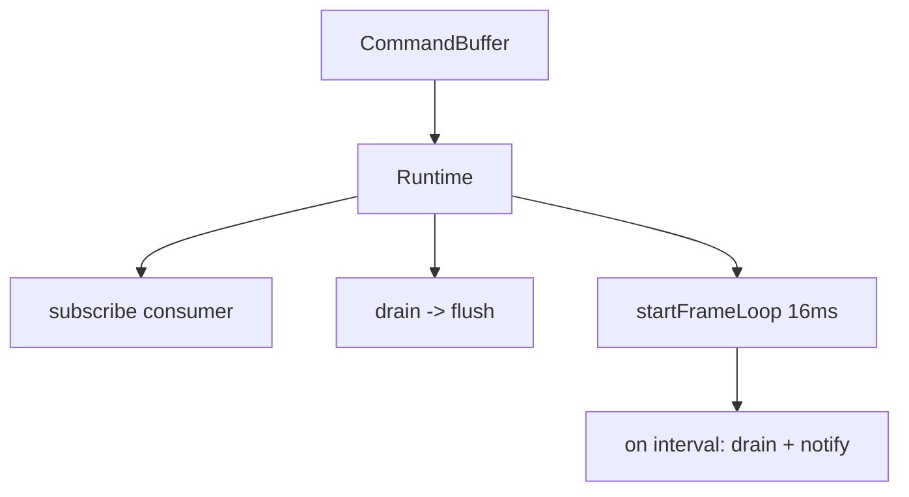

# Runtime

"Runtime" refers to the frame loop and command drain that tie the TypeScript command buffer to the Rust engine. There are two runtime constructs: one framework-agnostic in `@bettertui/core`, and one React-specific in `@bettertui/react`.

## Core Runtime (`@bettertui/core`)

`Runtime` owns a `CommandBuffer` and:
- `subscribe(consumer)` — register a sink for drained commands
- `drain()` — pull accumulated commands
- `flush()` — notify subscribers
- `startFrameLoop(durationMs = 16)` / `stopFrameLoop()` — timed drain+flush
- `dispose()` — tear down

## React Runtime (`@bettertui/react`)

`render(element)` creates a `Runtime`, a reconciler, and a container, then returns `{ root, runtime, dispose() }`. `RuntimeProvider` + `useRuntime()` expose the runtime to components for key handlers and frame control.

## Native Runtime (`@bettertui/native`)

`createRuntime(engine, eventBus, buffer)` returns `{ engine, eventBus, buffer, processCommands(), renderFrame(), resize(), shutdown() }` — the actual bridge that drives the Rust engine each frame.

## Status

All three runtime constructs are implemented; the engine is driven correctly at the native layer. (See the Scheduler architecture doc for known frame-timing issues.)
